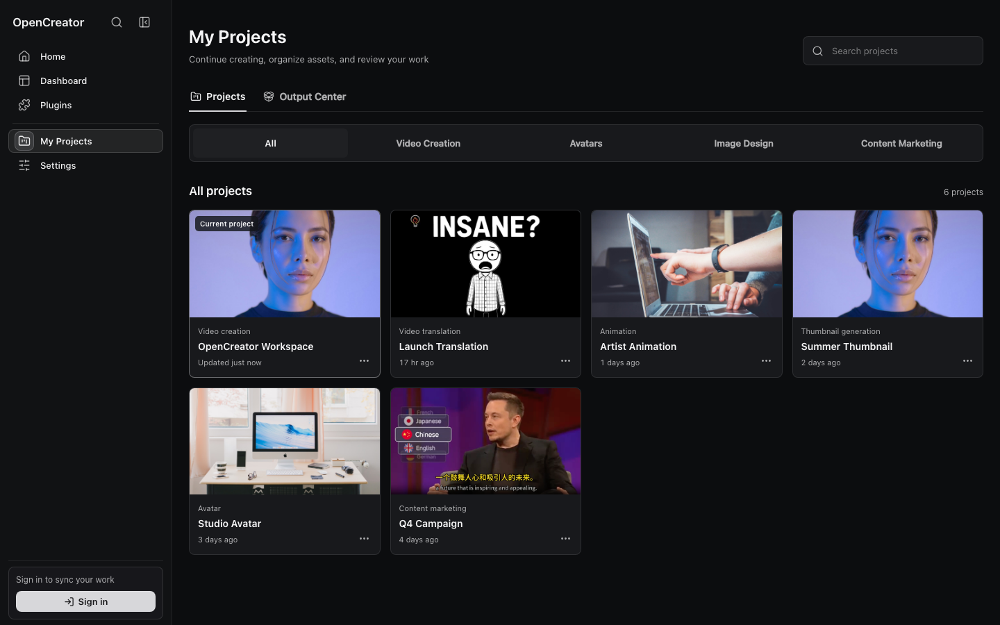
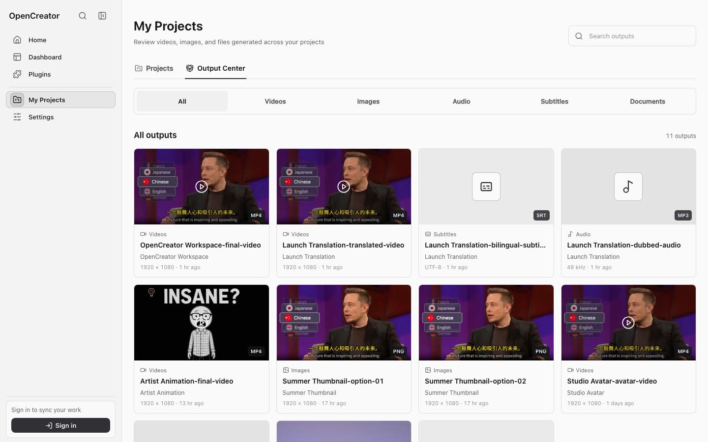
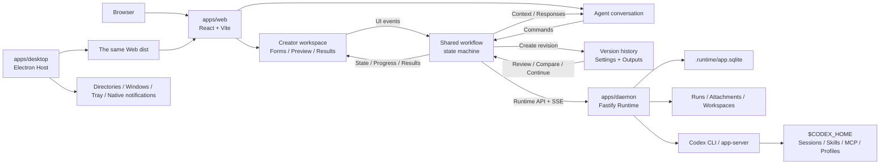

<div align="center">

<p>
  <picture>
    <source media="(prefers-color-scheme: dark)" srcset="./docs/images/opencreator-lockup-dark.svg" />
    
  </picture>
  <br />
  <picture>
    <source media="(prefers-color-scheme: dark)" srcset="./docs/images/opencreator-slogan-en-dark.svg" />
    
  </picture>
</p>

OpenCreator is a one-stop content creation Agent workspace that brings video, image, and voice creation together with projects, conversations, Skills, MCP, and long-running tasks.

OpenCreator is the next-generation upgrade of [KrillinAI](https://github.com/krillinai/KrillinAI), evolving from AI video translation into an all-in-one content creation Agent workspace.

<a href="https://trendshift.io/repositories/13360" target="_blank"></a>

**English** | [简体中文](./docs/zh/README.md)

[](https://github.com/krillinai/KrillinAI/stargazers)
[](https://space.bilibili.com/242124650)
[](https://jq.qq.com/?_wv=1027&k=754069680)

[Creator Tools](#creator-tools) · [Features](#key-features-and-functions) · [Product Tour](#product-tour) · [Examples](#examples) · [Quick Start](#quick-start) · [Desktop](#desktop) · [Architecture](#architecture) · [Development](#development) · [Documentation](#documentation) · [Star History](#star-history)

</div>

> [!IMPORTANT]
> OpenCreator is under active development and is currently best run from source. Real Agent tasks require the [Codex CLI](https://github.com/openai/codex) to be installed and authenticated on your machine. AI image, video, and voice features also depend on their corresponding service configuration.


## Project Overview

OpenCreator is built for individuals and teams who want to keep creative and development work running locally. Instead of reimplementing an Agent loop, it uses Codex CLI as the execution engine and adds a stable local Runtime, a visual workspace, and a Desktop host around it.

The product brings together two connected workflows:

- **AI content creation**: open dedicated workspaces for video translation, video generation, digital avatars, AI dubbing, automatic clipping, image generation, and more.
- **General Agent workspace**: organize conversations by project, keep Runs working in the background, and manage approvals, attachments, files, Skills, MCP, schedules, notifications, memory, and diagnostics from one place.

Web is the single frontend implementation. Desktop loads the same Web build and adds only capabilities that require the operating system, such as directory selection, window lifecycle, tray behavior, and native notifications. With the same data and content viewport, both platforms share the same general UI and Runtime behavior.

## Creator Tools

The Dashboard currently provides the workspaces below. Available models and services depend on your local Codex environment, AI service settings, and optional enterprise gateway.

| Workspace | Capabilities |
| --- | --- |
| Video Downloader | Parse YouTube, Bilibili, and other supported public links, inspect available quality and format options, and download video or audio for later workflows |
| Video Translation | Import local or public videos; transcribe with cloud or local Whisper services; use LLM context for subtitle segmentation, alignment, terminology, and translation; configure bilingual subtitles, dubbing or a custom voice sample, subtitle styles, landscape or portrait composition, and export SRT, audio, or video |
| Smart Editing | Analyze long-video semantics, control content focus, target duration, frame, and clip count, score highlights for hook, completeness, emotion, and shareability, then review transcripts and export selected clips |
| Stick Figure Video | Choose preset or custom characters, develop a story, generate and edit storyboards, review every shot, add narration and music, and retain versioned animation results |
| AI Video Generation | Generate video with Seedance, Kling, or Veo from a prompt, provider, aspect ratio, resolution, and duration, then track progress, preview the result, and download the output |
| Digital Avatar | Plan the presenter, script, voice delivery, scene, and composition for a structured digital-presenter video workflow |
| AI Dubbing | Refine a script, choose a voice and delivery style, adjust speaking rate, preview the audio, and export MP3, WAV, or other configured formats |
| Image Generation | Generate with GPT Image, Jimeng, Kling, or Gemini using configurable prompts, aspect ratios, quality, and output count, then preview and download individual images |
| Thumbnail Generator | Combine a topic, video link, and reference image to generate and compare multiple content-thumbnail variations |

## Key Features and Functions

### Agent Workspace

- 🔗 **Synchronized Workspace and Conversation**: A shared workflow state machine keeps form actions, Agent commands, progress, and results consistent across both interfaces.
- 🕘 **Versioned Creative Iteration**: Every correction or regeneration creates a new version instead of overwriting the current result, preserving earlier settings and outputs for review and comparison.
- 🤖 **Codex-Native Execution**: Reuse the Codex Agent loop, models, reasoning, tool calls, conversation history, Skills, MCP, and Profiles instead of maintaining a second execution engine.
- ⚙️ **Persistent Background Runs**: Keep work running across refreshes and conversation switches, with queueing, interruption, continuation, approval handling, and global result tracking.
- 📁 **Projects and File Workspace**: Organize conversations and assets by project, work with blank or existing local folders, edit text, and preview images, PDFs, and safe HTML.
- 🧩 **Skills and MCP Extensions**: Browse and install Skills, invoke them from the composer, and manage MCP servers through Codex-native configuration.
- 📅 **Long-Running Schedules**: Create, edit, pause, resume, and trigger scheduled tasks in persistent dedicated conversations that retain their complete Run history.
- 🧠 **Memory and Summaries**: Manage explicit global, project, and thread memory with versioned summaries and a reproducible input snapshot for each Run.
- 🔐 **Controlled Local Runtime**: Keep SQLite data, attachments, and Run logs local by default, enforce project permissions and approvals, and redact diagnostics before export.
- 💻 **Cross-Platform Web and Desktop**: Use one React frontend across macOS, Windows, and Linux in the browser or Electron Desktop, with the same general workflows and only genuine operating-system capabilities kept platform-specific.

## Product Tour

### Creator Dashboard

Open dedicated creation workspaces for video translation, animation, avatars, image generation, dubbing, clipping, and more.


### My Projects

Continue recent work, search across projects, and switch between video, avatar, image, and marketing collections.



### Output Center

Review generated videos, images, audio, subtitles, and documents across every project from a single output library.



## Examples

### Video Translation

The public examples below come from [KrillinAI](https://github.com/krillinai/KrillinAI), the open-source video localization project from the same team. They demonstrate the established subtitle alignment, translation, dubbing, and portrait-video workflow that OpenCreator's Video Translation workspace is designed to bring into a wider Agent workflow.

KrillinAI generated the subtitle file below from a 46-minute local video in one run, without manual subtitle adjustments. The published result shows complete coverage, no overlapping lines, natural segmentation, and high-quality translation.


<table>
<tr>
<td width="33%">

#### Subtitle Translation

https://github.com/user-attachments/assets/bba1ac0a-fe6b-4947-b58d-ba99306d0339

</td>
<td width="33%">

#### Dubbing

https://github.com/user-attachments/assets/0b32fad3-c3ad-4b6a-abf0-0865f0dd2385

</td>
<td width="33%">

#### Portrait Mode

https://github.com/user-attachments/assets/c2c7b528-0ef8-4ba9-b8ac-f9f92f6d4e71

</td>
</tr>
</table>

> Video examples and subtitle alignment image: [KrillinAI](https://github.com/krillinai/KrillinAI).

### Smart Editing

Turn long interviews, podcasts, lessons, and other source videos into standalone highlights. The Auto Clips workspace analyzes transcript semantics, scores each candidate for its hook, completeness, emotion, and shareability, then helps creators review, select, and export the strongest moments.


### Stick Figure Animation

OpenCreator developed this original character collection in collaboration with artists. The preset cast gives creators consistent, production-ready identities for stories and animation, while the workspace also supports uploaded references and generated characters.


From a character and story idea, the Agent workspace guides the project through storyboard generation, shot review, voiceover, music, and versioned animation output.


## Quick Start

### Prerequisites

- Node.js 22 or later
- pnpm 9.15.0, pinned through the repository's `packageManager` field
- A Codex CLI executable available in your terminal
- A valid Codex CLI login for real model tasks

Check your local environment first:

```bash
node --version
pnpm --version
codex --version
```

### Run Web from Source

```bash
git clone https://github.com/krillinai/OpenCreator.git
cd OpenCreator
corepack enable
pnpm install
pnpm web:dev
```

Open `http://127.0.0.1:9000/`. The development server starts the local daemon on demand and injects a temporary Runtime token through a same-origin proxy, so no connection token needs to be copied manually.

On first launch, the Runtime prepares a default project. The composer is ready as soon as the connection completes. To work on the daemon only:

```bash
pnpm daemon:dev
```

The daemon listens only on a loopback address and prints its connection address and temporary token to stdout once.

## Desktop

Desktop and the browser use the same React frontend from `apps/web`. General project, conversation, task, and settings behavior calls the same Daemon/API. Electron adds only real system paths, window controls, tray behavior, and native notifications.

### Development Mode

```bash
pnpm desktop:dev
```

### Local Packaging

| Command | Output |
| --- | --- |
| `pnpm desktop:package` | A runnable directory for the current platform, intended for local verification |
| `pnpm desktop:dist` | An installer for the current platform |
| `pnpm desktop:release` | The formal release packaging entry point |
| `pnpm --filter @opencreator/desktop verify:package` | Verification for an existing Desktop package |

Desktop packaging rebuilds Web from the current workspace, records the commit, dirty state, platform, architecture, and Web hash, and compares `apps/web/dist` with the resources embedded in the application. Packaging fails if they differ. See the [Desktop release runbook](./docs/operations/opencreator-desktop-release-runbook.md) for signing, notarization, Windows builds, and release requirements.

## Core Workflows

### Conversations and Runs

1. Select a project or start a new conversation.
2. Enter a task and choose the permission level, Profile, model, and reasoning effort.
3. While a Run is active, queue follow-up tasks or interrupt it and continue immediately.
4. Use the Timeline to inspect reasoning summaries, tool calls, file changes, approvals, and final results.
5. Use the task center to track running, completed, failed, and approval-blocked tasks globally.

### Skills and MCP

- Browse the Skill marketplace, installation history, and locally available Skills in the plugin center.
- Select a Skill from the composer with `/` or the add menu so the next task follows its workflow.
- MCP management passes through Codex-native commands and configuration instead of maintaining a second execution engine.
- OpenCreator uses the active `$CODEX_HOME` by default, so confirm the impact before changing global Skills or MCP configuration.

### Schedules and Dedicated Task Threads

- Every schedule owns a persistent, dedicated OpenCreator conversation.
- Automatic triggers, manual runs, and user follow-ups reuse that conversation and run serially with the `queue` or `skip` policy.
- Deleting a schedule archives its dedicated conversation while preserving existing Runs, results, and underlying Codex history.
- Rotating or recovering an underlying Codex thread does not change the OpenCreator task entry or page route.

## Architecture

OpenCreator treats the visual workspace and the Agent conversation as two interfaces to the same creative task, rather than two separate workflows. Each creator workflow is modeled as a state machine: source input, configuration, generation, review, revision, and export become explicit states and events. Workspace actions and conversational commands enter the same state machine, while the current step, configuration, progress, versions, and results are projected back into both interfaces. This keeps the workspace and conversation synchronized without introducing a second source of truth.

Creative work is iterative, so revisions do not overwrite the current result. Each correction or regeneration creates a new version from the existing workflow state, retaining the settings and outputs of earlier versions for review, comparison, and continued refinement.



Core principles:

- The workspace and Agent conversation are synchronized projections of one workflow state; both dispatch events to the same state machine instead of maintaining parallel task state.
- Revisions create new versions instead of replacing existing results, preserving the context and output of every creative iteration.
- The frontend does not launch Codex directly and does not depend on raw Codex JSONL event formats.
- The daemon owns process lifecycle, event normalization, persistence, approvals, schedules, and the notification outbox.
- Codex remains the execution source of truth for the Agent loop, Skills, and MCP.
- Browser Bridge and Desktop Bridge do not implement separate copies of general product logic.

## Repository Layout

```text
OpenCreator/
├── apps/
│   ├── web/          # The single React frontend implementation
│   ├── daemon/       # Local Fastify Runtime and Codex adapter
│   ├── desktop/      # Electron Main, Preload, native capabilities, and packaging
│   └── harness/      # Runtime command-line verification tool
├── packages/
│   ├── protocol/     # Runtime contracts shared by Web, Daemon, and Desktop
│   └── skill-market/ # Skill marketplace models and shared logic
├── docs/             # Design docs, API references, runbooks, and test reports
├── scripts/          # Repository-level checks
└── .runtime/         # Local Runtime data, created on first launch
```

## Configuration

### AI Service API Keys

Open **Settings → AI Services** to configure the providers used for text, transcription, voice, image, and video generation. Each category exposes only the fields required by its selected provider, including the Base URL, API Key, model, proxy, or provider-specific credentials.


Credentials are saved through the local Runtime's system credential storage and should never be committed to the repository. Some local or system-backed providers, such as Edge TTS, do not require an API Key.

### Runtime Environment Variables

Most users do not need environment variables. Use these when you need isolated data, a specific Codex executable, or a custom managed-project directory:

| Environment variable | Default | Purpose |
| --- | --- | --- |
| `OPENCREATOR_DATA_DIR` | `.runtime` | OpenCreator database, Runs, attachments, and managed workspaces |
| `OPENCREATOR_CODEX_BIN` | `codex` | Path to the Codex CLI executable |
| `CODEX_HOME` | `~/.codex` | Source of truth for Codex sessions, configuration, Skills, MCP, and Profiles |
| `OPENCREATOR_DEFAULT_CWD` | Current working directory | Default daemon working directory |
| `OPENCREATOR_DEFAULT_PROJECT_ROOT` | Runtime default policy | Managed-project root; when set, OpenCreator uses its `OpenCreator/` child directory |
| `OPENCREATOR_CODEX_THREAD_ROTATION_RUN_THRESHOLD` | `50` | Terminal Run threshold for rotating the Codex thread behind a long-running schedule; use `0` to disable proactive rotation |

For example, isolate both Runtime data and the Codex environment:

```bash
OPENCREATOR_DATA_DIR=/path/to/opencreator-data \
CODEX_HOME=/path/to/codex-home \
pnpm web:dev
```

The enterprise gateway cannot be injected through arbitrary environment variables and must use a controlled startup configuration file. See [Enterprise gateway configuration](./docs/企业网关配置说明-2026-08-06.md).

## Data and Security

Runtime data is stored under `.runtime/` in the repository root by default:

| Path | Contents |
| --- | --- |
| `.runtime/app.sqlite` | Projects, threads, Runs, events, schedules, notifications, attachment metadata, approvals, memory, and summaries |
| `.runtime/runs/` | Redacted logs, diagnostics, and metadata for individual Runs |
| `.runtime/attachments/` | Controlled attachment files |
| `.runtime/workspaces/` | Runtime-managed project workspaces |

Codex sessions and configuration remain in `$CODEX_HOME` and must be backed up separately from `.runtime/`.

Security boundaries include:

- The daemon listens only on `127.0.0.1`; every API except the health check requires a Bearer token.
- HTML preview disables scripts, navigation, and popups by default and allows only controlled same-workspace relative resources.
- Sensitive memory requires a second confirmation. OpenCreator never permanently stores unconfirmed suggestions automatically.
- Diagnostics and Run logs are redacted before they are returned or exported.
- Desktop packages enable ASAR integrity and cookie encryption while disabling RunAsNode, `NODE_OPTIONS`, and the Node CLI Inspector.

See the [user guide and troubleshooting reference](./docs/opencreator-user-guide-and-troubleshooting.md) for complete backup, restore, cleanup, and reset procedures.

## Development

### Common Commands

| Command | Purpose |
| --- | --- |
| `pnpm web:dev` | Start Web and launch the local daemon on demand |
| `pnpm daemon:dev` | Start the daemon only |
| `pnpm desktop:dev` | Build dependencies and start Electron in development mode |
| `pnpm test` | Run workspace unit and integration tests |
| `pnpm typecheck` | Run TypeScript checks across the repository |
| `pnpm build` | Build every workspace |
| `pnpm e2e` | Run Web Playwright E2E tests |
| `pnpm smoke:ci` | Run the fake-Codex Runtime smoke test |
| `pnpm perf:check` | Check the recorded performance baseline |

Before submitting a change, run at least:

```bash
pnpm test
pnpm typecheck
pnpm build
```

Changes to Desktop, Host Bridge, the Runtime proxy, or shared frontend workflows also require Web/Desktop consistency tests, packaged application E2E, and Web build hash verification. Passing Web unit tests alone does not establish Desktop release readiness.

The real Codex smoke test is disabled by default. Enable it explicitly with:

```bash
OPENCREATOR_RUN_REAL_CODEX_SMOKE=1 \
pnpm --filter @opencreator/daemon test -- test/smoke/real-codex-smoke.test.ts
```

## Frequently Asked Questions

<details>
<summary><strong>The page remains stuck on "Connecting to the local runtime"</strong></summary>

Confirm that `pnpm web:dev` is still running, then open `http://127.0.0.1:9000/.opencreator/runtime/healthz`. A healthy response is `{"ok":true}`. If port 9000 is occupied, stop the old process and try again.

</details>

<details>
<summary><strong>The interface opens, but real tasks do not run</strong></summary>

Run `codex --version` to confirm the CLI is available, then check your Codex authentication. Errors such as `401 token_expired` or `refresh_token_reused` require signing in to Codex again. Do not delete `.runtime` to work around an authentication failure.

</details>

<details>
<summary><strong>Why does the browser not show local folder selection or window controls?</strong></summary>

Those actions require Electron to provide real system paths or window capabilities and appear only when the corresponding Desktop capability is available. Projects, conversations, tasks, and file editing remain shared between Web and Desktop.

</details>

<details>
<summary><strong>How do I back up all local data?</strong></summary>

Stop Web and the daemon, then back up the entire `.runtime/` directory rather than only SQLite. Attachments and Run snapshots live in separate subdirectories. Back up Codex `$CODEX_HOME` separately.

</details>

See the [user guide and troubleshooting reference](./docs/opencreator-user-guide-and-troubleshooting.md) for more.

## Documentation

- [User guide and troubleshooting](./docs/opencreator-user-guide-and-troubleshooting.md)
- [Runtime API v1](./docs/runtime-api-for-ui-v1.md)
- [Codex-native Runtime design](./docs/2026-07-03-codex-native-agent-runtime-design.md)
- [Desktop release runbook](./docs/operations/opencreator-desktop-release-runbook.md)
- [Windows Desktop release guide](./docs/operations/opencreator-desktop-windows-release.md)
- [Enterprise gateway configuration](./docs/企业网关配置说明-2026-08-06.md)
- [Visual component guidelines](./docs/visual-component-guidelines.md)

## Translation Convention

The root `README.md` is the canonical English document. Maintained translations live at `docs/<locale>/README.md`. Add a language to the switcher only after its full document has been translated and synchronized with the English structure.

## Contributing

1. Describe the problem, use case, and expected behavior in [Issues](https://github.com/krillinai/OpenCreator/issues).
2. Create a focused feature or fix branch from the latest development branch.
3. Follow the existing architecture: implement general product capabilities once in Web and Daemon, and isolate native differences behind explicit capabilities.
4. Add appropriate unit, integration, or E2E coverage for behavior changes, and list both completed and skipped verification in the Pull Request.
5. Never commit `.runtime/`, local credentials, Codex sessions, build caches, or other user data.

## Star History

OpenCreator is the next evolution of KrillinAI. Until the repository upgrade is complete, this chart follows the original [`krillinai/KrillinAI`](https://github.com/krillinai/KrillinAI) repository history.

[](https://star-history.dera.page/#KrillinAI/KrillinAI&Date)

## Acknowledgements

OpenCreator is built on [OpenAI Codex](https://github.com/openai/codex), [React](https://react.dev/), [Fastify](https://fastify.dev/), [Electron](https://www.electronjs.org/), [SQLite](https://www.sqlite.org/), and the [Model Context Protocol](https://modelcontextprotocol.io/).

---

<div align="center">

**OpenCreator · Create locally, work continuously.**

</div>
