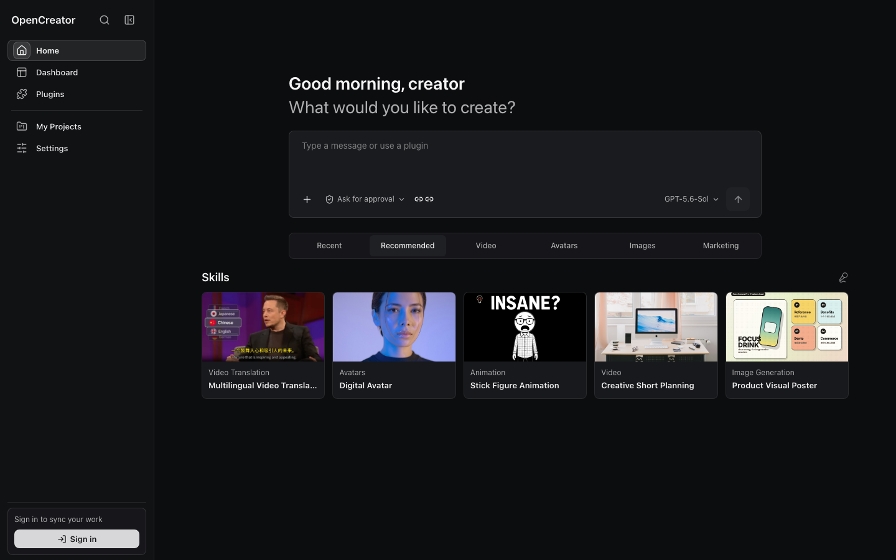
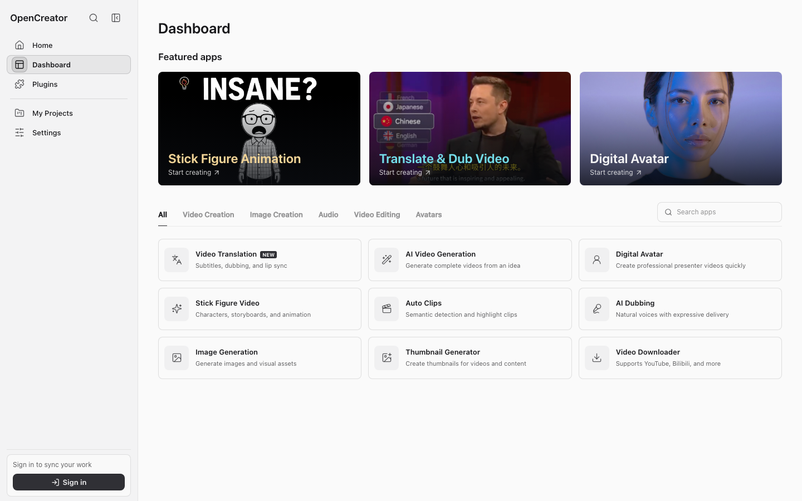
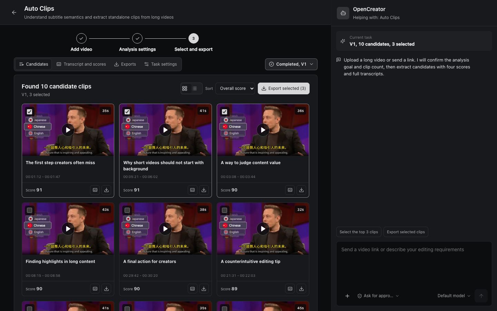
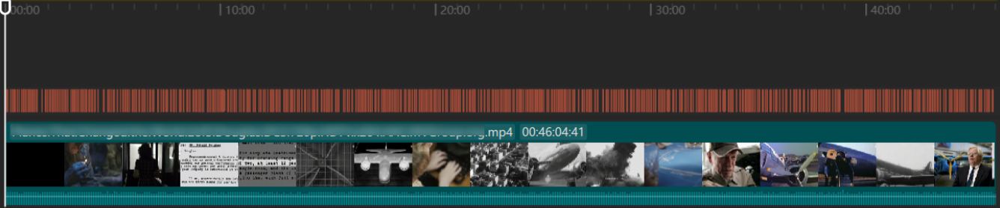
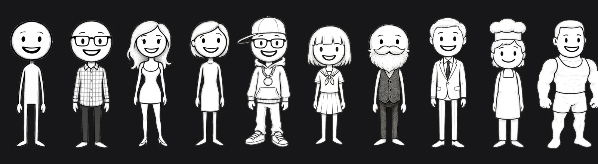
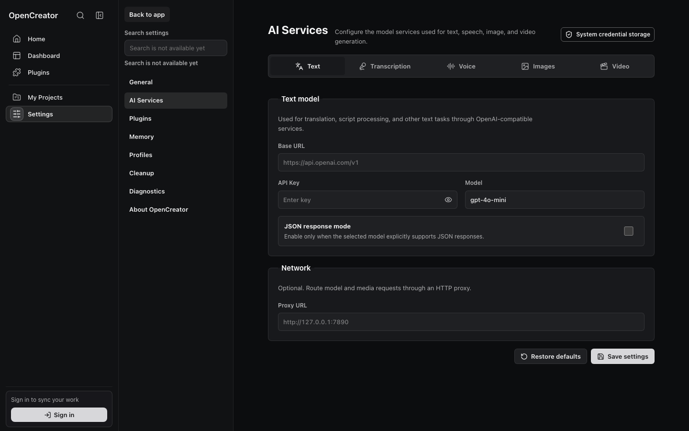

<div align="center">

<h1>
  <picture>
    <source media="(prefers-color-scheme: dark)" srcset="../images/OpenCreator_logo_vector_dark.svg" />
    
  </picture>
  <br />
  مساحة عمل الذكاء الاصطناعي مفتوحة المصدر للمبدعين
</h1>

<p>من النصوص إلى الفيديو والصور والصوت والصور الرمزية والترجمة والتحرير، تدفع Agents عملية الإبداع كاملة إلى الأمام في مساحة عمل واحدة.</p>

<p><strong>كان OpenCreator يُعرف سابقًا باسم KrillinAI.</strong></p>

<a href="https://trendshift.io/repositories/13360" target="_blank"></a>

[English](../../README.md) | [简体中文](../zh/README.md) | [日本語](../ja/README.md) | [한국어](../ko/README.md) | [Bahasa Indonesia](../id/README.md) | [Español](../es/README.md) | [Français](../fr/README.md) | [Deutsch](../de/README.md) | [Português](../pt/README.md) | [Русский](../ru/README.md) | **العربية**

[](https://github.com/krillinai/OpenCreator/stargazers)
[](https://www.apache.org/licenses/LICENSE-2.0)
[](https://space.bilibili.com/242124650)
[](https://discord.gg/3GwBGsjs8)
[](https://qm.qq.com/q/W4YC0PLMeA)

[أبرز ميزات المشروع](#أبرز-ميزات-المشروع) · [أدوات الإنشاء](#أدوات-الإنشاء) · [المحادثة ومساحة العمل](#المحادثة-ومساحة-العمل-تتقدمان-معًا) · [النماذج المدعومة](#النماذج-المدعومة) · [أمثلة](#أمثلة) · [البدء السريع](#البدء-السريع) · [Desktop](#desktop) · [بنية النظام](#بنية-نظام-opencreator) · [التطوير](#التطوير) · [الوثائق](#الوثائق) · [المساهمون](#المساهمون) · [سجل Stars](#سجل-stars)

</div>



## نظرة عامة على المشروع

صُمم OpenCreator للأفراد والفرق الذين يرغبون في إبقاء أعمالهم الإبداعية والتطويرية قيد التشغيل محليًا. وبدلًا من إعادة تنفيذ حلقة Agent، يستخدم Codex CLI كمحرك للتنفيذ ويضيف إليه Runtime محليًا مستقرًا ومساحة عمل مرئية ومضيف Desktop.

يجمع المنتج بين مساري عمل مترابطين:

- **إنشاء المحتوى بالذكاء الاصطناعي**: استخدم أدوات إنشاء مخصصة لترجمة الفيديو وتنزيله وإنشاء الصور المصغرة وتوليد الصور.
- **مساحة عمل Agent عامة**: نظّم المحادثات حسب المشروع، وأبقِ Runs قيد العمل في الخلفية، وأدر الموافقات والمرفقات والملفات وSkills وMCP والجداول الزمنية والإشعارات والذاكرة والتشخيصات من مكان واحد.

يمثل Web تطبيق الواجهة الأمامية الوحيد. يحمّل Desktop بناء Web نفسه ولا يضيف سوى الإمكانات التي تتطلب نظام التشغيل، مثل اختيار المجلدات ودورة حياة النوافذ وسلوك علبة النظام والإشعارات الأصلية. وعند استخدام البيانات نفسها وأبعاد عرض المحتوى نفسها، تشترك المنصتان في الواجهة العامة وسلوك Runtime ذاتهما.

## أبرز ميزات المشروع

- 🤖 **تكامل أصلي مع Codex**: أعد استخدام حلقة Agent والنماذج والاستدلال واستدعاءات الأدوات والمحادثات وSkills وMCP في Codex دون الحاجة إلى صيانة محرك تنفيذ ثانٍ.

- 🚀 **تطبيق Desktop جاهز للاستخدام**: شغّل OpenCreator مباشرة من تطبيق Desktop الذي يتضمن Codex CLI؛ يبدأ Runtime المحلي عند الطلب ويُجهز مشروعًا افتراضيًا تلقائيًا.

- 🔄 **مكونات Runtime مُدارة**: اعرض إصدارات yt-dlp المضمّنة والنشطة والأحدث، وتحقق دوريًا من التحديثات وحدّث يدويًا، مع إبقاء الإصدار الحالي العامل متاحًا إذا فشل التحديث.

- 🎨 **إنشاء متعدد الوسائط**: أنشئ الفيديو والصور والصوت والترجمات والوثائق وأدرها ضمن مسار عمل واحد مترابط.

- 🔗 **مسار عمل بوضعين**: اعمل من مساحة العمل المرئية أو من محادثة Agent، بينما تحافظ آلة حالات مشتركة على مزامنة الخطوات والتقدم والنتائج.

- 🕘 **إدارة الإصدارات**: ينشئ كل تعديل إصدارًا جديدًا مع الاحتفاظ بالإعدادات والمخرجات السابقة للمراجعة والمقارنة.

- 🧩 **Skills وMCP**: تصفح Skills وثبّتها واستخدمها، مع إدارة MCP عبر إعدادات Codex الأصلية.

- 🧠 **الذاكرة**: احتفظ بذاكرة عامة وذاكرة لكل مشروع ولكل سلسلة محادثة، إلى جانب الملخصات ولقطات مدخلات Run القابلة لإعادة الإنتاج.

- 🔐 **الأمان المحلي**: احتفظ بالبيانات والمرفقات والسجلات محليًا بشكل افتراضي، مع الموافقات والتشخيصات المنقحة لإخفاء المعلومات الحساسة.

## أدوات الإنشاء

يتضمن الإصدار الحالي أربع أدوات إنشاء. تعتمد النماذج والخدمات المتاحة على بيئة Codex المحلية وإعدادات خدمات الذكاء الاصطناعي.

افتح Dashboard لترجمة الفيديو أو تنزيل مقاطع الفيديو العامة أو إنشاء الصور المصغرة أو توليد الصور.



> تُضاف أدوات إنشاء جديدة باستمرار.

<table width="100%">
<thead>
<tr>
<th width="18%">الأداة</th>
<th width="14%">الحالة</th>
<th width="68%">الإمكانات</th>
</tr>
</thead>
<tbody>
<tr><td valign="top">ترجمة الفيديو</td><td valign="top">✅ متاح</td><td>استورد مقاطع فيديو محلية أو عامة؛ وحوّل الكلام إلى نص باستخدام خدمات Whisper السحابية أو المحلية؛ واستخدم سياق LLM لتقسيم الترجمات ومحاذاتها ومعالجة المصطلحات والترجمة؛ واضبط الترجمات ثنائية اللغة أو الدبلجة أو عينة صوت مخصصة وأنماط الترجمة والتنسيق الأفقي أو العمودي، ثم صدّر SRT أو الصوت أو الفيديو</td></tr>
<tr><td valign="top">تنزيل الفيديو</td><td valign="top">✅ متاح</td><td>حلّل الروابط العامة المدعومة من YouTube وBilibili والخدمات الأخرى، واستعرض خيارات الجودة والتنسيق المتاحة، ثم نزّل الفيديو أو الصوت لاستخدامه في مسارات العمل اللاحقة</td></tr>
<tr><td valign="top">إنشاء الصور المصغرة</td><td valign="top">✅ متاح</td><td>ادمج موضوعًا ورابط فيديو وصورة مرجعية اختيارية لإنشاء عدة خيارات من الصور المصغرة للمحتوى ومقارنتها</td></tr>
<tr><td valign="top">توليد الصور</td><td valign="top">✅ متاح</td><td>أنشئ صورًا باستخدام GPT Image انطلاقًا من prompt وصورة مرجعية اختيارية، واضبط نسبة العرض إلى الارتفاع وعدد النتائج، ثم عاين كل صورة ونزّلها</td></tr>
<tr><td valign="top">رسوم شخصيات العصا المتحركة</td><td valign="top">قريبًا</td><td>طوّر الشخصيات والقصص المصورة والتعليق الصوتي والرسوم المتحركة ضمن مسار عمل موجه</td></tr>
<tr><td valign="top">المقاطع التلقائية</td><td valign="top">قيد التطوير</td><td>حلّل مقاطع الفيديو الطويلة وحدد أبرز اللحظات وحوّل المقاطع المختارة إلى مقاطع قصيرة قابلة لإعادة الاستخدام</td></tr>
<tr><td valign="top">الدبلجة الذكية</td><td valign="top">قيد التطوير</td><td>حوّل النصوص إلى تعليق صوتي مع اختيار الصوت وضبط الإيقاع والعاطفة</td></tr>
<tr><td valign="top">توليد الفيديو</td><td valign="top">قيد التطوير</td><td>أنشئ فيديو من الأوامر النصية والصور المرجعية، ثم عاين النتيجة وصدّرها</td></tr>
<tr><td valign="top">الصورة الرمزية الرقمية</td><td valign="top">قيد التطوير</td><td>ادمج النص والصوت وعرض الصورة الرمزية لإنتاج فيديوهات ناطقة</td></tr>
</tbody>
</table>

## المحادثة ومساحة العمل تتقدمان معًا

صِف المهام بلغة طبيعية، ثم انتقل إلى الأدوات المرئية عندما تحتاج إلى تحكم دقيق.



### عناصر تحكم دقيقة في مساحة العمل

اضبط الترجمات واللقطات والصوت وإعدادات التوليد بدقة.

### تعديلات مرنة عبر المحادثة

أخبر Agent بما تريد تغييره وحسّن النتيجة باستخدام اللغة الطبيعية.

### حالة متزامنة

تتشارك المحادثة ومساحة العمل حالة المهمة الحالية، فلا حاجة إلى تكرار المعلومات.

### إصدارات مستقلة

ينشئ كل تعديل إصدارًا منفصلًا دون الكتابة فوق النتائج أو الإعدادات السابقة.

## النماذج المدعومة

يعتمد توفر النماذج اللغوية على كتالوج نماذج Codex أو مزود متوافق مع OpenAI قمت بإعداده. تستخدم نماذج الصور والصوت والنسخ الخدمات المُعدّة في **الإعدادات ← خدمات الذكاء الاصطناعي**.

### النماذج اللغوية

<table>
<tr>
<td align="center" width="20%"><br /><strong>GPT</strong></td>
<td align="center" width="20%"><br /><strong>DeepSeek</strong></td>
<td align="center" width="20%"><br /><strong>Qwen</strong></td>
<td align="center" width="20%"><br /><strong>Kimi</strong></td>
<td align="center" width="20%"><br /><strong>GLM</strong></td>
</tr>
<tr>
<td align="center" width="20%"><br /><strong>Grok</strong></td>
<td align="center" width="20%"><br /><strong>Doubao</strong></td>
<td align="center" width="20%"><br /><strong>ERNIE</strong></td>
<td align="center" width="20%"><br /><strong>Hunyuan</strong></td>
<td width="20%"></td>
</tr>
</table>

### الصور

<table>
<tr>
<td align="center"><br /><strong>GPT Image</strong></td>
</tr>
</table>

### الصوت والنسخ

<table>
<tr>
<td align="center" width="20%"><br /><strong>Whisper</strong></td>
<td align="center" width="20%"><br /><strong>OpenAI TTS</strong></td>
<td align="center" width="20%"><br /><strong>MiniMax</strong></td>
<td align="center" width="20%"><br /><strong>Edge TTS</strong></td>
<td align="center" width="20%"><br /><strong>Aliyun Speech</strong></td>
</tr>
</table>

## أمثلة

### ترجمة الفيديو

أُنتجت الأمثلة العامة أدناه عندما كان OpenCreator لا يزال يحمل اسم KrillinAI. وهي توضح مسار العمل الراسخ لمحاذاة الترجمات والترجمة والدبلجة والفيديو العمودي الذي تضيفه مساحة عمل ترجمة الفيديو في OpenCreator إلى مسار Agent أوسع.

أنشأ المشروع ملف الترجمة أدناه من فيديو محلي مدته 46 دقيقة في عملية تشغيل واحدة، دون أي تعديلات يدوية على الترجمة. تغطي النتيجة المنشورة الفيديو كاملًا دون تداخل الأسطر، مع تقسيم طبيعي وترجمة عالية الجودة.



<table width="100%">
<tr>
<td width="33%">

#### ترجمة النصوص

https://github.com/user-attachments/assets/bba1ac0a-fe6b-4947-b58d-ba99306d0339

</td>
<td width="33%">

#### الدبلجة

https://github.com/user-attachments/assets/0b32fad3-c3ad-4b6a-abf0-0865f0dd2385

</td>
<td width="33%">

#### الوضع العمودي

https://github.com/user-attachments/assets/c2c7b528-0ef8-4ba9-b8ac-f9f92f6d4e71

</td>
</tr>
</table>

> أُنتجت أمثلة الفيديو هذه وصورة محاذاة الترجمات عندما كان OpenCreator لا يزال يستخدم اسم KrillinAI.

### تنزيل الفيديو

حلّل رابط فيديو عامًا، وقارن التنسيقات المتاحة، ثم نزّل الفيديو أو الصوت مباشرةً إلى المشروع.


### رسوم شخصيات العصا المتحركة (قريبًا)

> قريبًا. لم تُدمج هذه الميزة بعد في الإصدار الحالي.

طوّر OpenCreator هذه المجموعة الأصلية من الشخصيات بالتعاون مع الفنان [Harbor Hsia](https://www.behance.net/xiaheyuan1)، مبتكر [Stickman على Behance](https://www.behance.net/gallery/254715463/Stickman). ويجري إعداد مجموعة الشخصيات المسبقة لمسار عمل مستقبلي للقصص والرسوم المتحركة بهويات متسقة للشخصيات.



سيقود مسار العمل المخطط له فكرة الشخصية والقصة عبر إنشاء لوحة القصة ومراجعة اللقطات والتعليق الصوتي والموسيقى وإخراج نسخ متعددة من الرسوم المتحركة.


## البدء السريع

### المتطلبات الأساسية

- Node.js 22 أو أحدث
- pnpm 9.15.0، المثبّت عبر حقل `packageManager` في المستودع
- ملف Codex CLI تنفيذي متاح في الطرفية
- تسجيل دخول صالح إلى Codex CLI لتنفيذ مهام حقيقية باستخدام النماذج

تحقق أولًا من بيئتك المحلية:

```bash
node --version
pnpm --version
codex --version
```

### تشغيل Web من الشفرة المصدرية

```bash
git clone https://github.com/krillinai/OpenCreator.git
cd OpenCreator
corepack enable
pnpm install
pnpm web:dev
```

افتح `http://127.0.0.1:19861/`. يشغّل خادم التطوير daemon المحلي عند الطلب، ويحقن رمز Runtime مؤقتًا عبر وكيل من المصدر نفسه، لذلك لا حاجة إلى نسخ رمز الاتصال يدويًا.

عند التشغيل الأول، يُجهّز Runtime مشروعًا افتراضيًا. يصبح مربع الإدخال جاهزًا بمجرد اكتمال الاتصال. للعمل على daemon فقط:

```bash
pnpm daemon:dev
```

لا يستمع daemon إلا على عنوان loopback، ويطبع عنوان الاتصال والرمز المؤقت إلى stdout مرة واحدة.

## Desktop

يستخدم Desktop والمتصفح واجهة React الأمامية نفسها من `apps/web`. تستدعي العمليات العامة للمشاريع والمحادثات والمهام والإعدادات Daemon/API نفسها. ولا يضيف Electron سوى مسارات النظام الحقيقية وعناصر التحكم في النوافذ وسلوك علبة النظام والإشعارات الأصلية.

### وضع التطوير

```bash
pnpm desktop:dev
```

### الحزم المحلية

| الأمر | الناتج |
| --- | --- |
| `pnpm desktop:package` | مجلد قابل للتشغيل للمنصة الحالية، مخصص للتحقق المحلي |
| `pnpm desktop:dist` | برنامج تثبيت للمنصة الحالية |
| `pnpm desktop:release` | نقطة الدخول لحزم الإصدار الرسمي |
| `pnpm --filter @opencreator/desktop verify:package` | التحقق من حزمة Desktop موجودة |

تعيد عملية حزم Desktop بناء Web من مساحة العمل الحالية، وتسجل commit وحالة dirty والمنصة والبنية وhash الخاص بـ Web، ثم تقارن `apps/web/dist` بالموارد المضمنة في التطبيق. تفشل عملية الحزم إذا اختلفت. راجع [دليل تشغيل إصدارات Desktop](../operations/opencreator-desktop-release-runbook.md) لمعرفة متطلبات التوقيع والتوثيق وبناء Windows والإصدار.

## مسارات العمل الأساسية

### المحادثات وRuns

1. اختر مشروعًا أو ابدأ محادثة جديدة.
2. أدخل مهمة واختر مستوى الصلاحية وProfile والنموذج ومستوى الاستدلال.
3. أثناء نشاط Run، أضف مهام المتابعة إلى قائمة الانتظار أو أوقفه وتابع فورًا.
4. استخدم Timeline لاستعراض ملخصات الاستدلال واستدعاءات الأدوات وتغييرات الملفات والموافقات والنتائج النهائية.
5. استخدم مركز المهام لتتبع المهام قيد التشغيل والمكتملة والفاشلة والمحجوبة بانتظار الموافقة على مستوى النظام.

### Skills وMCP

- تصفح سوق Skills وسجل التثبيت وSkills المتاحة محليًا في مركز الإضافات.
- اختر Skill من مربع الإدخال باستخدام `/` أو قائمة الإضافة لتتبع المهمة التالية مسار عملها.
- تمر إدارة MCP عبر أوامر Codex وإعداداته الأصلية بدلًا من صيانة محرك تنفيذ ثانٍ.
- يستخدم OpenCreator قيمة `$CODEX_HOME` النشطة افتراضيًا، لذا تحقق من التأثير قبل تغيير Skills العامة أو إعدادات MCP.

### الجداول الزمنية وسلاسل المهام المخصصة

- يمتلك كل جدول زمني محادثة OpenCreator دائمة ومخصصة.
- تعيد المشغلات التلقائية وعمليات التشغيل اليدوية ومتابعات المستخدم استخدام تلك المحادثة وتعمل بالتتابع وفق سياسة `queue` أو `skip`.
- تؤدي إزالة جدول زمني إلى أرشفة محادثته المخصصة مع الاحتفاظ بـ Runs والنتائج وسجل Codex الأساسي.
- لا يؤدي تدوير سلسلة Codex الأساسية أو استردادها إلى تغيير إدخال مهمة OpenCreator أو مسار الصفحة.

## بنية نظام OpenCreator

يتعامل OpenCreator مع مساحة العمل المرئية ومحادثة Agent باعتبارهما واجهتين للمهمة الإبداعية نفسها، لا مساري عمل منفصلين. يُنمذج كل مسار إنشاء كآلة حالات: تصبح مدخلات المصدر والإعداد والتوليد والمراجعة والتعديل والتصدير حالات وأحداثًا صريحة. تدخل إجراءات مساحة العمل وأوامر المحادثة إلى آلة الحالات نفسها، بينما تُعرض الخطوة الحالية والإعداد والتقدم والإصدارات والنتائج في كلتا الواجهتين. يحافظ ذلك على مزامنة مساحة العمل والمحادثة دون تقديم مصدر بيانات ثانٍ.

العمل الإبداعي تكراري، لذلك لا تستبدل التعديلات النتيجة الحالية. ينشئ كل تصحيح أو إعادة توليد إصدارًا جديدًا من حالة مسار العمل الحالية، مع الاحتفاظ بإعدادات الإصدارات السابقة ومخرجاتها للمراجعة والمقارنة ومواصلة التحسين.

```text
+-----------------------------+     +------------------------------------+
| Browser Access              |     | Desktop Host                       |
|                             |     | Shared Web build + Electron        |
+--------------+--------------+     +------------------+-----------------+
               |                                       |
               +-------------------+-------------------+
                                   v
+----------------------------------------------------------------------------+
| Creator Experience / apps/web                                              |
| Dashboard / Creator Tools / Agent Conversation / Settings / Files          |
+-------------------------------------+--------------------------------------+
                                      |
+-------------------------------------v--------------------------------------+
| Collaboration Core                                                         |
| Shared workflow state / Steps / Progress / Results / Versions              |
+-------------------------------------+--------------------------------------+
                                      | Runtime API + SSE
+-------------------------------------v--------------------------------------+
| Local Runtime / apps/daemon                                                 |
| Projects / Runs / Approvals / Schedules / Memory / Notifications           |
| Component status / Update checks / Verified updates / Safe fallback        |
+-------------+------------------------+------------------------+-------------+
              |                        |                        |
              v                        v                        v
+---------------------+  +---------------------+  +-------------------------+
| Local Data          |  | Codex Engine        |  | Media Toolchain         |
| SQLite / Files      |  | CLI / app-server    |  | FFmpeg / yt-dlp         |
| System credentials  |  | Skills / MCP        |  | Whisper / AI services   |
+---------------------+  +---------------------+  +-------------------------+
```

| مكوّن OpenCreator | المسؤولية | التنفيذ |
| --- | --- | --- |
| تجربة الإنشاء | Dashboard وأدوات الإنشاء ومحادثة Agent والإعدادات والملفات | `apps/web` · React 18 · Vite · TypeScript |
| نواة التعاون | تزامن خطوات مساحة العمل وسياق المحادثة والتقدم والنتائج والمراجعات | حالة مسار عمل مشتركة · `CreatorCollaborationPanel` · سجل الإصدارات |
| Runtime المحلي | يدير المشاريع وRuns والموافقات والجداول والذاكرة والإشعارات | `apps/daemon` · Fastify · Runtime API · SSE |
| مكونات Runtime | تتبع الإصدارات المضمّنة والنشطة والأحدث، وتتحقق دوريًا ولا تثبت إلا التحديثات التي يطلبها المستخدم | yt-dlp nightly · التحقق من التحديث · الرجوع إلى الإصدار العامل |
| محرك Codex | يوفر حلقة Agent والجلسات والاستدلال والأدوات وSkills وMCP | Codex CLI · app-server |
| سلسلة أدوات الوسائط | تنزّل الوسائط الإبداعية وتنسخها وتحولها وتولدها وتصدرها | yt-dlp · Whisper · FFmpeg · خدمات الذكاء الاصطناعي المُعدّة |
| البيانات المحلية | تخزن بيانات المشاريع وRuns والمرفقات والمخرجات وبيانات الاعتماد محليًا | SQLite · نظام الملفات · مخزن بيانات اعتماد النظام |
| مضيف Desktop | يحمّل بناء Web المشترك ويضيف إمكانات نظام التشغيل | `apps/desktop` · Electron · Preload Bridge |

المبادئ الأساسية:

- مساحة العمل ومحادثة Agent عرضان متزامنان لحالة مسار العمل نفسها؛ يرسل كلاهما الأحداث إلى آلة الحالات نفسها بدلًا من الاحتفاظ بحالات مهام متوازية.
- تنشئ التعديلات إصدارات جديدة بدلًا من استبدال النتائج الحالية، ما يحافظ على سياق كل دورة إبداعية ومخرجاتها.
- لا تشغّل الواجهة الأمامية Codex مباشرة ولا تعتمد على تنسيق أحداث JSONL الخام في Codex.
- يدير daemon دورة حياة العمليات وتوحيد الأحداث والتخزين الدائم والموافقات والجداول الزمنية وصندوق إرسال الإشعارات.
- يظل Codex مصدر التنفيذ الأساسي لحلقة Agent وSkills وMCP.
- لا ينفذ Browser Bridge وDesktop Bridge نسختين منفصلتين من منطق المنتج العام.

## بنية المستودع

```text
OpenCreator/
├── apps/
│   ├── web/          # التطبيق الوحيد لواجهة React الأمامية
│   ├── daemon/       # Runtime محلي باستخدام Fastify ومهايئ Codex
│   ├── desktop/      # Electron Main وPreload والإمكانات الأصلية والحزم
│   └── harness/      # أداة سطر أوامر للتحقق من Runtime
├── packages/
│   ├── protocol/     # عقود Runtime المشتركة بين Web وDaemon وDesktop
│   └── skill-market/ # نماذج سوق Skills والمنطق المشترك
├── docs/             # مستندات التصميم ومراجع API وأدلة التشغيل وتقارير الاختبار
├── scripts/          # عمليات التحقق على مستوى المستودع
└── .runtime/         # بيانات Runtime المحلية التي تُنشأ عند التشغيل الأول
```

## الإعداد

### مفاتيح API لخدمات الذكاء الاصطناعي

افتح **الإعدادات ← خدمات الذكاء الاصطناعي** لإعداد موفري النماذج والنسخ الصوتي والصوت والصور الذين تستخدمهم مساحات العمل الحالية. قد تظهر فئات خدمات إضافية استعدادًا لأدوات الإنشاء القادمة. لا تعرض كل فئة إلا الحقول المطلوبة للموفر المحدد، بما في ذلك Base URL وAPI Key والنموذج والوكيل وبيانات الاعتماد الخاصة بالموفر.



تُحفظ بيانات الاعتماد عبر مخزن بيانات اعتماد النظام في Runtime المحلي، ويجب عدم إضافتها إلى المستودع مطلقًا. لا يحتاج بعض الموفرين المحليين أو المدعومين من النظام، مثل Edge TTS، إلى API Key.

### مكونات Runtime التابعة لجهات خارجية

افتح **الإعدادات ← مكونات الجهات الخارجية** لعرض إصدار yt-dlp nightly المستخدم حاليًا، والإصدار المضمّن مع OpenCreator، ومصدره، وأحدث إصدار متاح. يتحقق OpenCreator من التحديثات كل سبعة أيام، لكنه لا يثبتها تلقائيًا. تتطلب التحديثات إجراءً صريحًا من المستخدم، ويظل الإصدار الحالي العامل متاحًا إذا فشل التنزيل أو التحقق أو التثبيت.


### متغيرات بيئة Runtime

لا يحتاج معظم المستخدمين إلى متغيرات البيئة. استخدمها عندما تحتاج إلى بيانات معزولة أو ملف Codex تنفيذي محدد أو مجلد مخصص للمشاريع المُدارة:

| متغير البيئة | القيمة الافتراضية | الغرض |
| --- | --- | --- |
| `OPENCREATOR_DATA_DIR` | `.runtime` | قاعدة بيانات OpenCreator وRuns والمرفقات ومساحات العمل المُدارة |
| `OPENCREATOR_CODEX_BIN` | `codex` | مسار ملف Codex CLI التنفيذي |
| `CODEX_HOME` | `~/.codex` | المصدر الأساسي لجلسات Codex وإعداداته وSkills وMCP وProfiles |
| `OPENCREATOR_DEFAULT_CWD` | مجلد العمل الحالي | مجلد العمل الافتراضي لـ daemon |
| `OPENCREATOR_DEFAULT_PROJECT_ROOT` | سياسة Runtime الافتراضية | جذر المشاريع المُدارة؛ عند تعيينه يستخدم OpenCreator المجلد الفرعي `OpenCreator/` داخله |
| `OPENCREATOR_CODEX_THREAD_ROTATION_RUN_THRESHOLD` | `50` | حد Runs النهائية لتدوير سلسلة Codex وراء جدول زمني طويل الأمد؛ استخدم `0` لتعطيل التدوير الاستباقي |

على سبيل المثال، لعزل بيانات Runtime وبيئة Codex معًا:

```bash
OPENCREATOR_DATA_DIR=/path/to/opencreator-data \
CODEX_HOME=/path/to/codex-home \
pnpm web:dev
```

## البيانات والأمان

تُحفظ بيانات Runtime افتراضيًا ضمن `.runtime/` في جذر المستودع:

| المسار | المحتوى |
| --- | --- |
| `.runtime/app.sqlite` | المشاريع والسلاسل وRuns والأحداث والجداول الزمنية والإشعارات والبيانات الوصفية للمرفقات والموافقات والذاكرة والملخصات |
| `.runtime/runs/` | السجلات المنقحة والتشخيصات والبيانات الوصفية لكل Run |
| `.runtime/attachments/` | ملفات المرفقات الخاضعة للتحكم |
| `.runtime/workspaces/` | مساحات عمل المشاريع التي يديرها Runtime |

تبقى جلسات Codex وإعداداته في `$CODEX_HOME` ويجب نسخها احتياطيًا بشكل منفصل عن `.runtime/`.

تشمل حدود الأمان ما يلي:

- لا يستمع daemon إلا على `127.0.0.1`؛ وتتطلب كل واجهات API، باستثناء فحص الصحة، رمز Bearer.
- تعطل معاينة HTML البرامج النصية والتنقل والنوافذ المنبثقة افتراضيًا، ولا تسمح إلا بالموارد النسبية الخاضعة للتحكم من مساحة العمل نفسها.
- تتطلب الذاكرة الحساسة تأكيدًا ثانيًا. لا يخزن OpenCreator الاقتراحات غير المؤكدة تلقائيًا وبشكل دائم أبدًا.
- تُنقح التشخيصات وسجلات Runs قبل إعادتها أو تصديرها.
- تفعّل حزم Desktop تكامل ASAR وتشفير ملفات تعريف الارتباط، مع تعطيل RunAsNode و`NODE_OPTIONS` وNode CLI Inspector.

راجع [دليل المستخدم واستكشاف الأخطاء وإصلاحها](../opencreator-user-guide-and-troubleshooting.md) للاطلاع على إجراءات النسخ الاحتياطي والاستعادة والتنظيف وإعادة الضبط كاملة.

## التطوير

### الأوامر الشائعة

| الأمر | الغرض |
| --- | --- |
| `pnpm web:dev` | تشغيل Web وبدء daemon المحلي عند الطلب |
| `pnpm daemon:dev` | تشغيل daemon فقط |
| `pnpm desktop:dev` | بناء التبعيات وتشغيل Electron في وضع التطوير |
| `pnpm test` | تشغيل اختبارات الوحدة والتكامل لمساحات العمل |
| `pnpm typecheck` | تشغيل فحوصات TypeScript في المستودع بأكمله |
| `pnpm build` | بناء جميع workspaces |
| `pnpm e2e` | تشغيل اختبارات Playwright الشاملة لـ Web |
| `pnpm smoke:ci` | تشغيل اختبار smoke لـ Runtime باستخدام Codex محاكى |
| `pnpm perf:check` | فحص خط الأداء الأساسي المسجل |

قبل إرسال أي تغيير، شغّل على الأقل:

```bash
pnpm test
pnpm typecheck
pnpm build
```

تتطلب التغييرات في Desktop أو Host Bridge أو وكيل Runtime أو مسارات العمل المشتركة للواجهة الأمامية أيضًا اختبارات اتساق Web/Desktop واختبارات شاملة للتطبيق المحزّم والتحقق من hash بناء Web. لا يكفي اجتياز اختبارات الوحدة في Web وحدها لإثبات جاهزية إصدار Desktop.

يكون اختبار smoke باستخدام Codex الحقيقي معطلًا افتراضيًا. فعّله صراحةً باستخدام:

```bash
OPENCREATOR_RUN_REAL_CODEX_SMOKE=1 \
pnpm --filter @opencreator/daemon test -- test/smoke/real-codex-smoke.test.ts
```

## الوثائق

- [دليل المستخدم واستكشاف الأخطاء وإصلاحها](../opencreator-user-guide-and-troubleshooting.md)
- [Runtime API v1](../runtime-api-for-ui-v1.md)
- [تصميم Runtime الأصلي لـ Codex](../2026-07-03-codex-native-agent-runtime-design.md)
- [دليل تشغيل إصدارات Desktop](../operations/opencreator-desktop-release-runbook.md)
- [دليل إصدار Desktop لنظام Windows](../operations/opencreator-desktop-windows-release.md)
- [إرشادات المكونات المرئية](../visual-component-guidelines.md)

## قواعد الترجمة

يمثل ملف `README.md` في الجذر المستند الإنجليزي الأساسي. توجد الترجمات المُصانة في `docs/<locale>/README.md`. لا تضف لغة إلى أداة التبديل إلا بعد ترجمة مستندها كاملًا ومزامنته مع بنية النسخة الإنجليزية.

## المساهمة

1. صِف المشكلة وحالة الاستخدام والسلوك المتوقع في [Issues](https://github.com/krillinai/OpenCreator/issues).
2. أنشئ فرعًا محددًا للميزة أو الإصلاح انطلاقًا من أحدث فرع تطوير.
3. اتبع البنية الحالية: نفّذ إمكانات المنتج العامة مرة واحدة في Web وDaemon، واعزل الاختلافات الأصلية خلف capabilities صريحة.
4. أضف تغطية مناسبة باختبارات الوحدة أو التكامل أو الاختبارات الشاملة لتغييرات السلوك، واذكر في Pull Request عمليات التحقق المكتملة والمتجاوزة.
5. لا تضف مطلقًا `.runtime/` أو بيانات الاعتماد المحلية أو جلسات Codex أو ذاكرات البناء المؤقتة أو بيانات المستخدم الأخرى إلى commit.

## المساهمون

شكرًا لكل من شارك عبر الشفرة والوثائق والملاحظات وتقارير المشكلات وSkills والتصميمات والأفكار.

<a href="https://github.com/krillinai/KrillinAI/graphs/contributors">
  
</a>

## سجل Stars

كان OpenCreator يُعرف سابقًا باسم KrillinAI. يغطي هذا المخطط سجل المستودع كاملًا قبل تغيير الاسم وبعده.

[](https://star-history.com/#krillinai/KrillinAI&Date)

## المشاريع ذات الصلة

| المشروع | الدور |
| --- | --- |
| [OpenAI Codex](https://github.com/openai/codex) | محرك تنفيذ Agent الذي يوفر الوصول إلى النماذج والاستدلال واستدعاءات الأدوات والجلسات وSkills وتكامل MCP. |
| [yt-dlp](https://github.com/yt-dlp/yt-dlp) | يفحص روابط الوسائط العامة المدعومة ويسرد التنسيقات المتاحة وينزّل الفيديو أو الصوت لمسارات الإنشاء. |
| [FFmpeg](https://ffmpeg.org/) | يتولى FFmpeg وffprobe تحويل الوسائط وتركيبها واستخراج الإطارات والتحقق من المخرجات. |
| [Whisper](https://github.com/openai/whisper) و[whisper.cpp](https://github.com/ggml-org/whisper.cpp) و[faster-whisper](https://github.com/SYSTRAN/faster-whisper) و[WhisperKit](https://github.com/argmaxinc/WhisperKit) | خيارات نسخ صوتي سحابية ومحلية خاصة بالمنصة، تُختار وفق إمكانات Runtime المتاحة. |
| [React](https://react.dev/) | أساس واجهة المستخدم المشتركة لتجربتي Web وDesktop. |
| [Fastify](https://fastify.dev/) | أساس HTTP وAPI لـ Runtime المحلي. |
| [Electron](https://www.electronjs.org/) | مضيف Desktop لإمكانات النظام الأصلية ودورة حياة التطبيق والحزم. |
| [SQLite](https://www.sqlite.org/) | التخزين المحلي للمشاريع والمحادثات وRuns والجداول والذاكرة وبيانات مساحة العمل الأخرى. |
| [Model Context Protocol](https://modelcontextprotocol.io/) | بروتوكول مفتوح لربط الأدوات والخدمات الخارجية بمساحة عمل Agent. |

---

<div align="center">

**OpenCreator · أنشئ محليًا، واعمل باستمرار.**

</div>
