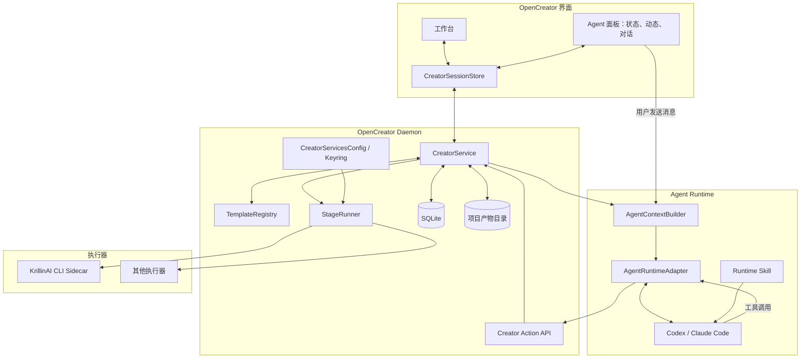

# OpenCreator 模板化创作架构方案

> 状态：草案
> 体量判断：复杂方案。该交付同时涉及前端共享状态、Daemon 持久化、Agent Runtime 抽象、Skill 生命周期、外部 KrillinAI 进程、凭证配置、媒体产物和多阶段产品演进；各部分共同约束同一个创作任务，不能独立验收，因此保持一份内聚方案。
> 设计确认：已完成（D-1 至 D-4）
> Reviewer 原始结论：REVISE
> 流程结论：PASS
> 用户批准：已批准（2026-08-20），批准原话：`没问题，继续`

## 背景、目标与非目标

OpenCreator 当前已经具备成熟的 Codex Runtime、Daemon、Web/Desktop 共用前端、任务事件和 AI 服务配置基础，但上层创作功能仍处于 Demo 阶段。视频翻译、视频下载、封面、自动剪辑和火柴人视频目前主要表现为硬编码工作区、React 本地状态和关键词回调，尚未形成可持久化、可恢复、可扩展的创作产品。

### 目标

1. 将 OpenCreator 定位为面向个人创作者和小型内容团队的 AI 内容创作工作台，责任终点为内容成品预览与导出，不处理发布。
2. 让工作台和 Agent 面板成为同一个创作任务的两个平等操作入口，双方共享状态、当前关注、创作动态和版本结果。
3. 建立最小且可执行的模板、任务、阶段和产物契约，以视频翻译作为 P0 真实闭环，并同时定义下载、封面、自动剪辑和火柴人视频的后续方案。
4. 保持 OpenCreator 核心与 Codex 解耦：模板和业务状态属于 OpenCreator，Skill 属于 Agent Runtime 适配层，Codex/Claude Code 可通过适配器替换。
5. 将 KrillinAI 定位为媒体阶段执行器，由 OpenCreator 负责任务编排、进程生命周期、配置注入、结果校验和失败恢复。

### 非目标

1. 内容上传、定时发布、发布审批、平台状态跟踪和发布数据分析。
2. Premiere/剪映式完整非线性编辑器。
3. 用户可视化拖拽节点的通用工作流平台或用户自定义模板编辑器。
4. P0 多人实时协作、组织权限和审批流。
5. 以 Skill、聊天记录或 KrillinAI Manifest 作为创作任务的唯一状态源。
6. P0 同时实现全部五类功能的真实执行闭环。

## 用户需求原文

1. `底层使用codex的运行时确实很成熟了，我需要你重点关注的是上层opencreator交互的设计，里面涉及多个功能：视频翻译，封面等，这些是由模版化的方式运行，这里需要你认真分析出来，现在实现的是demo层面，需要给出实际的需求分析。`
2. `视频的下载、翻译等都是用这个工具git@github.com:krillinai/KrillinAI.git，你可以拉取到当前目录看下有什么能力，然后再结合上面的分析来一起设计方案。`
3. `$zhiyu-brainstorm 你分不同段落来梳理需求和方案，我跟你一起来完成，让我可以消化，一次太多，我消化不过来，从产品需求定位开始，再到方案设计，一步步来，但也不要拆分的过细，整个过程控制在10~20次交互之内吧，开始`
4. `经过少量关键审核，得到可直接发布的多平台内容包 -- 这里有误差，OpenCreator暂时不处理发布，只做内容创作，所以不需要再增加审核发布环节`
5. `这里有一个很关键的点你没提到，就是工作台的信息和Agent区域的互动，这是这个产品的核心灵魂，也就是说，用户可以在工作台进行创作，也可以在Agent区域进行创作，但二者的状态是同步的。`
6. `现在开始进入方案设计了，要求就是，方案能简单就简单，要满足奥卡姆剃刀原理，另外就是方案一定要具备可执行性。`
7. `最难的就是Creator Core这一层了，这是最核心的部分，如何做好状态同步，以及Agent上下文的处理，包括模版的设计。我理解下：这里的模版流程什么的，让Agent能识别，是不是需要做成skills，因为底层是codex，只能靠skills串联，还是说每次把全部上下文全丢给Agent处理呢，这个要评估下。`
8. `用户在任何一边的操作，都要实时相互同步，也就是在工作台只要有操作，就要在Agent侧有体现，这个体现不一定是要Agent执行，而是要有一定的提示。`
9. `模版是更上层的，skills是codex底层的东西，所以我说为什么要把整个模版上下文全部都给Agent，是因为，OpenCreator是一个上层Agent，codex是底层执行的，那skills到底应该是属于谁的呢，如果底层换了Claude code的话，能适配吗？`
10. `稳定 Skill 安装一次 -- 在什么时机安装呢，正常来说，用户肯定不会显示去处理，可能也看不懂什么是skill。`
11. `功能可以分不同阶段，P0确实可以先从最小的开始验证，但是其他阶段的方案也要一起出出来，方便后续指导开发。`

## 事实基线与假设

### 事实基线

| 证据 | 已确认事实 |
| --- | --- |
| `apps/web/src/features/conversation/CreatorWorkbench.tsx`、`creator-workspace.ts` | 当前五个创作入口映射到硬编码工作区，没有统一模板协议。 |
| `CreatorToolShell.tsx` | 通用 Agent 消息保存在组件 `useState`，通过本地 `onCommand` 回调返回 Demo 文本。 |
| `VideoTranslationWorkspace.tsx`、`VideoTranslationAgentPanel.tsx` | 视频翻译 Demo 已支持 Agent 修改左侧状态、撤销、控件高亮和派生 `contextSummary`；工作台操作尚未形成持久化创作动态。 |
| `apps/daemon/src/storage/*`、`packages/protocol/src/events.ts` | Daemon 已有 SQLite、任务状态和 SSE/事件基础，可以承载 CreatorService，无需新增独立服务。 |
| `apps/daemon/src/codex/app-server-runner.ts` | 当前 Codex Runtime 可传入 Prompt、恢复 Thread、注入 MCP/内置工具和处理取消，不是只能依赖 Skills。 |
| `apps/daemon/src/codex/skills/scanner.ts` | Codex Skill 从应用指定 `CODEX_HOME/skills/<id>/SKILL.md` 扫描，可使用应用隔离 Codex Home。 |
| `apps/daemon/src/creator-services/config-store.ts` | 文本、ASR、TTS、图片、视频和代理配置已通过系统 Keyring 安全保存。 |
| `KrillinAI/internal/cli/commands.go` | KrillinAI 真实 CLI 支持 `subtitle`、`tts`、`render-horizontal`、`render-vertical`、`cover` 和 `voices`；`pipeline/status` 未形成可靠执行能力。 |
| `KrillinAI/internal/router/router.go`、`internal/service/subtitle_service.go` | KrillinAI HTTP Server 主要提供旧版字幕综合任务，任务状态保存在内存，全局配置和取消/恢复能力不满足正式集成。 |
| `KrillinAI/internal/pipeline/manifest.go` | Manifest 可作为执行结果证据之一，但没有 OpenCreator 所需的版本、审核、stale、实时进度和血缘语义。 |
| KrillinAI 提交 `a9f4ec2` | 本方案能力判断基于 2026-08-19 拉取的该版本。 |
| `AGENTS.md` | Web 是唯一前端实现，Desktop 必须复用同一 Web 构建、Daemon API、状态和通用业务逻辑。 |

### 假设

1. P0 是本机单用户创作软件，不设计 CRDT 和多人并发编辑。
2. OpenCreator 可以随安装包携带平台对应的 KrillinAI、FFmpeg 和必要媒体依赖。
3. P0 仅正式实现 CodexAgentAdapter，但所有 OpenCreator 业务契约保持运行时无关。
4. P0 可以接受 KrillinAI 的真实阶段级进度；细粒度百分比在 KrillinAI 提供 JSONL 事件后实现。
5. 视频翻译 P0 只承诺 YouTube、Bilibili 和本地媒体输入。

## 设计确认记录

| 设计部分 | 核心决定 | 用户确认原话 |
| --- | --- | --- |
| D-1 产品定位与目标边界 | OpenCreator 只做内容创作、预览和导出；创作确认不是发布审批；P0 面向个人创作者和小型团队。 | `没问题，继续` |
| D-2 模板化产品结构与双向创作交互 | 模板是可版本化生产契约；工作台与 Agent 是统一创作状态之上的两个平等入口；视频下载是基础能力，封面可独立也可嵌入模板。 | `没问题，继续` |
| D-3 系统架构与运行边界 | 采用共享 CreatorSession、薄 CreatorService、运行时无关 Agent Action API；模板不等同于 Skill；基础 Skill 由 Daemon 自动安装到隔离 Runtime Home；KrillinAI P0 按阶段调用 CLI。 | `没问题，继续` |
| D-4 实施范围与验收 | P0 以最小视频翻译闭环验证架构，P1/P2 方案同时写入本方案供后续开发使用。 | `功能可以分不同阶段，P0确实可以先从最小的开始验证，但是其他阶段的方案也要一起出出来，方便后续指导开发，没问题，继续吧` |

## 需求与业务规则

| ID | 类型 | 优先级 | 描述 |
| --- | --- | --- | --- |
| FR-1 | 功能需求 | P0 | OpenCreator 从素材或创作意图开始，完成模板化内容创作、预览和导出，不包含发布流程。 |
| FR-2 | 功能需求 | P0 | 每次模板运行创建可持久化 CreatorJob，并保存模板版本、阶段、产物版本、创作动态和失败记录。 |
| FR-3 | 功能需求 | P0 | 工作台和 Agent 面板实时展示同一 CreatorSession；任一侧的有效操作都必须在另一侧的状态或创作动态中体现。 |
| FR-4 | 功能需求 | P0 | Agent 面板必须同时提供当前创作状态、创作动态和模型对话，并允许 Agent 通过运行时无关的 Creator Action 修改任务。 |
| FR-5 | 功能需求 | P0 | 视频翻译支持 YouTube、Bilibili、本地媒体、字幕生成与编辑、可选 TTS、横竖屏渲染、版本保留、预览和导出。 |
| FR-6 | 功能需求 | P0 | OpenCreator 提供统一 AI 服务配置并映射给 KrillinAI；Agent Runtime 认证与生产模型凭证分开管理。 |
| FR-7 | 功能需求 | P1 | 视频下载形成可独立使用且可被其他模板复用的 `probe/download` 基础能力；封面支持独立和嵌入式多方案创作。 |
| FR-8 | 功能需求 | P2 | 自动剪辑和火柴人视频复用统一 CreatorSession、模板、Agent Action 和 StageRunner，并通过独立执行器补齐核心生成能力。 |
| BR-1 | 业务规则 | P0 | TemplateDefinition 是模板业务规则的唯一权威位置；Skill 不得保存阶段状态、产物依赖或 UI 规则。 |
| BR-2 | 业务规则 | P0 | 单纯工作台操作只更新共享状态和创作动态，不得启动 Codex Run 或消耗模型 Token。 |
| BR-3 | 业务规则 | P0 | 高频文字输入实时更新共享草稿，但只在失焦、保存或聚合阈值到达时产生语义创作动态。 |
| BR-4 | 业务规则 | P0 | 所有持久化修改携带 `expectedRevision`；旧 revision 不得覆盖新状态。 |
| BR-5 | 业务规则 | P0 | 上游内容变化后保留旧产物版本，并将受影响的下游产物标记为 `stale`，不得静默复用。 |
| BR-6 | 业务规则 | P0 | KrillinAI P0 采用每个 StageRun 一个 CLI 进程；是否引入常驻 Worker 必须由真实预热和吞吐数据决定。 |
| BR-7 | 业务规则 | P0 | 执行成功必须同时通过进程结果、Manifest/JSON 解析和媒体文件校验，不能制造假进度或假成功。 |
| BR-8 | 业务规则 | P0 | `opencreator-runtime` Skill 由 Daemon 自动同步到应用隔离 Runtime Home，用户无需理解、安装或配置 Skill。 |
| NFR-1 | 一致性约束 | P0 | Web/Desktop 使用同一 React 前端、Protocol、Daemon CreatorService、模板和 Agent Action 实现。 |
| NFR-2 | 恢复约束 | P0 | 页面刷新和 Daemon 重启后可恢复 Job、阶段、产物和创作动态；中断中的外部进程标记为 `interrupted` 并允许重试。 |
| NFR-3 | 安全约束 | P0 | API Key 不进入 React 持久状态、CreatorJob、聊天上下文、普通日志、诊断包或导出产物。 |
| NFR-4 | 交互约束 | P0 | 同一页面内的工作台变化同步更新 Agent 状态视图，不依赖网络轮询或模型调用。 |
| NFR-5 | 可替换性约束 | P0 | TemplateDefinition、CreatorSession 和 Creator Action 不引用 Codex 专属类型；Codex/Claude 差异只存在于 AgentRuntimeAdapter。 |
| NFR-6 | 打包约束 | P0 | 正式安装包固定并记录 KrillinAI 及媒体依赖版本，运行时不克隆仓库或下载不受控可执行文件。 |

## 方案比较与推荐

### Creator 状态方案

| 方案 | 影响 | 结论 |
| --- | --- | --- |
| React 本地状态 + Agent 回调 | 延续 Demo，无法持久化、恢复或跨模板复用。 | 排除 |
| 通用工作流引擎 + 事件溯源 | 扩展性高，但需要 DSL、事件重放和复杂迁移，超出当前需求。 | 排除 |
| 前端共享 SessionStore + Daemon 薄 CreatorService | 同时满足实时展示、持久化、版本冲突和最小实现。 | 采用 |

### Agent 上下文方案

| 方案 | 影响 | 结论 |
| --- | --- | --- |
| 每轮传入完整模板、字幕、历史和日志 | Token 成本高，容易使用过期状态。 | 排除 |
| 每个模板复制为 Codex Skill | 模板业务规则与 Skill 漂移，绑定 Codex。 | 排除 |
| 稳定 Runtime Skill + 最小动态上下文 + 按需工具读取 | 稳定规则安装一次，业务状态实时读取，支持运行时替换。 | 采用 |

### KrillinAI 运行方案

| 方案 | 影响 | 结论 |
| --- | --- | --- |
| 复用现有 HTTP Server | 只覆盖旧字幕任务，状态在内存，配置与取消边界不足。 | 排除 |
| 每 StageRun 启动 CLI | 隔离、取消、重试、配置映射和打包边界清晰。 | P0 采用 |
| 新建常驻 Worker | 可复用本地大模型预热，但增加协议、健康、并发和恢复复杂度。 | 有性能证据后采用 |

## 关键设计决策

| DEC ID | 决策 | 理由 | 约束范围 |
| --- | --- | --- | --- |
| DEC-1 | CreatorSessionStore 是同一前端实例中工作台和 Agent 面板的共享展示状态；CreatorService 是持久业务状态的唯一权威。 | 同时满足即时交互和重启恢复，避免两侧互发业务通知。 | Web、Desktop、Daemon |
| DEC-2 | Agent 面板固定由状态摘要、创作动态和模型对话三部分组成。 | 工作台操作可以在 Agent 区域体现，而无需伪造 Agent 消息或调用模型。 | 所有模板 UI |
| DEC-3 | CreatorService 直接作为现有 Daemon 内模块实现，不新增微服务、消息队列、CRDT 或事件溯源。 | 符合单机产品和奥卡姆剃刀原则。 | Daemon、SQLite |
| DEC-4 | TemplateDefinition 以静态 TypeScript 定义和 Schema 校验实现，P0 不提供 YAML、数据库或可视化模板编辑器。 | 保持类型安全和可执行性，避免过早建设通用平台。 | TemplateRegistry、UI、StageRunner |
| DEC-5 | OpenCreator 核心使用运行时无关 AgentContract 和 Creator Action API；MCP/Native Tools 只是 AgentRuntimeAdapter 的传输实现。 | 支持 Codex 与 Claude Code 替换，避免产品绑定 MCP 或 Skill。 | Agent 集成 |
| DEC-6 | 稳定 Agent 行为规则作为 `opencreator-runtime` Skill 安装到应用隔离 Runtime Home；模板定义不写入 Skill。 | 不污染用户全局环境，避免业务规则双写。 | Runtime Bootstrap、打包 |
| DEC-7 | 每轮只提供 Job、模板、revision、阶段、当前选中项、最近变化和允许动作；大产物按需读取。 | 控制 Token，保证 Agent 使用最新状态。 | AgentContextBuilder |
| DEC-8 | KrillinAI P0 作为固定版本 CLI Sidecar，每个 StageRun 独立进程和工作目录。 | 当前 CLI 能力比 HTTP Server 完整，进程隔离和恢复语义清晰。 | StageRunner、打包 |
| DEC-9 | Codex 用于交互式理解和文本修改，批量 ASR、翻译、TTS、生图和视频阶段使用 CreatorServicesConfig 指定的生产服务。 | Codex 认证不能安全、稳定地冒充外部 API；生产阶段需要可重试、可计量和结构化结果。 | Agent、KrillinAI、配置 |
| DEC-10 | P0 只完成视频翻译真实闭环，但 P1/P2 必须复用同一领域契约，不允许再创建独立 React 状态流程。 | 用一个垂直切片验证架构，同时约束后续演进。 | 产品路线、所有模板 |
| DEC-11 | P1 视频下载由 OpenCreator Daemon 的 DownloadExecutor 直接封装打包固定版本的 yt-dlp，不等待 KrillinAI 新增下载命令。 | 下载是多个模板共用的输入能力，OpenCreator 需要直接掌握 probe、格式选择、进度和 Artifact 登记。 | P1 下载、打包、StageRunner |
| DEC-12 | P1 封面由 OpenCreator ImageExecutor 负责，使用 CreatorServicesConfig.image 调用 OpenAI-compatible 生成/编辑接口；多候选和比例由模板编排，KrillinAI `cover` 只作为兼容执行器而非首选所有者。 | 避免单图 CLI 限制，并固定参考图、多候选和多比例的扩展位置。 | P1 封面、图片配置、Artifact |

## 详细设计

### 全局架构



### CreatorSessionStore 与创作动态

1. Store 同时保存已确认 Session 快照和当前页面未提交草稿；工作台输入立即更新 Store，因此 Agent 状态区同步显示。
2. 普通文本输入按短 debounce 写入 CreatorService；执行、生成版本、删除或覆盖等重要动作等待 Daemon 确认。
3. 用户发送 Agent 消息前必须 flush 当前草稿，再构造 AgentContext，避免模型读取旧值。
4. CreatorService 对成功的语义操作返回 `CreatorActionReceipt`，至少包含 `actor`、`summary`、`affectedArtifacts`、`newRevision` 和时间。
5. 状态摘要实时派生；Activity 只记录语义变化。逐字符输入、鼠标移动和普通预览时间变化不得形成永久 Activity。
6. Agent 修改结果通过同一 Store 展示，并对相关控件或内容进行短时高亮；撤销仍通过 Creator Action 创建新 revision，不直接回滚前端状态。

### 最小数据模型

```text
creator_jobs
  id, project_id, template_id, template_version,
  status, revision, state_json, created_at, updated_at

creator_stage_runs
  id, job_id, stage_id, executor, status,
  progress_json, error_code, error_message,
  started_at, finished_at

creator_artifacts
  id, job_id, kind, version, status, path,
  source_artifact_ids_json, metadata_json, created_at

creator_activities
  id, job_id, revision, actor, action,
  summary, details_json, created_at
```

`state_json` 由 TemplateDefinition 对应的 Schema 校验；列表和恢复所需字段保留为独立列。媒体文件不写入 SQLite。

### 状态语义

Job 状态：

```text
draft → running → needs_input → running → completed
                 ↘ failed / canceled
```

Daemon 重启时尚未结束的 StageRun 变为 `interrupted`，Job 根据是否可重试进入 `needs_input` 或保留 `failed` 原因。

Artifact 状态：

```text
draft | technical_preview | completed | stale
```

`completed` 只表示模板预期创作和技术校验完成，不代表发布或平台审核。

### TemplateDefinition

```ts
type CreatorTemplate = {
  id: string;
  version: number;
  renderer: string;
  inputSchema: unknown;
  stages: Array<{
    id: string;
    executor: string;
    dependsOn?: string[];
    optional?: boolean;
    allowedJobStatuses: string[];
    inputArtifacts: Array<{
      kind: string;
      selector: "latest-completed" | "explicit-version";
      optional?: boolean;
    }>;
    outputArtifacts: Array<{
      kind: string;
      status: "technical_preview" | "completed";
    }>;
  }>;
  actions: Array<{
    id: string;
    inputSchema: unknown;
    allowedStages: string[];
    invalidates?: Array<{
      sourceArtifactKind: string;
      propagateThroughStageGraph: boolean;
    }>;
  }>;
  outputs: Array<{ kind: string; required: boolean }>;
  agentGuidance: string;
};
```

P0 模板以静态 TypeScript 对象注册，不实现通用 DSL。`agentGuidance` 只提供当前模板的简短创作语义，不能重复阶段和失效规则。CreatorService 只依据 `inputArtifacts/outputArtifacts` 构建产物依赖边，并从动作声明的源产物开始沿阶段图传播 `stale`；执行器不得自行定义另一套失效规则。

视频翻译的最小依赖实例：

```text
source_video
  └─ subtitle stage
       ├─ source_subtitle
       └─ target_subtitle
            ├─ tts stage → dubbed_audio
            ├─ render-horizontal stage → horizontal_video
            └─ render-vertical stage → vertical_video

render-horizontal / render-vertical 还读取 source_video，
启用配音时读取 dubbed_audio，未启用时该输入为 optional。
```

`edit-subtitle` 声明从 `target_subtitle` 开始传播失效，因此只将依赖该字幕版本的配音和横竖屏视频标记为 `stale`，源视频和源字幕保持有效。StageRunner 启动前必须解析每个必需输入的具体 Artifact 版本；缺少输入或输入不是 `completed` 时不启动执行器。

### Agent、Skill 与上下文

1. OpenCreator 安装包携带只读 `opencreator-runtime` Skill 和版本清单。
2. Daemon 启动时由 AgentRuntimeBootstrap 将其原子同步到应用专属隔离 Codex Home；不存在时安装，版本或哈希不一致时替换，初始化失败时禁用 Agent 但不影响工作台。
3. 创建 Codex Thread 的首轮 Prompt 由 CodexAgentAdapter 增加固定前缀 `$opencreator-runtime`，明确要求先加载该 Skill 并调用 `creator_get_context`；后续恢复同一 Thread。为抵抗会话压缩，后续每轮只重复 Skill 标识和契约版本，不拼接整份 `SKILL.md`。
4. 每轮动态上下文只包含 `jobId/templateId/templateVersion/revision/currentStage/selection/recentChanges/allowedActions`。
5. 字幕、脚本、分镜和历史版本由 Agent 通过范围读取工具获取。
6. AgentRuntimeAdapter 接口保持运行时无关，CodexAdapter 可用 MCP 或原生 Tools，ClaudeAdapter 可映射到其工具协议或兼容 MCP。
7. P0 不为每个模板创建 Skill。后续专业 Skill 只能补充非确定性的创作方法，不能成为业务规则权威位置。

运行时无关适配契约为：

```ts
type StableAgentGuide = {
  id: "opencreator-runtime";
  version: number;
  contentHash: string;
  instructions: string;
};

interface AgentRuntimeAdapter {
  ensureStableGuide(guide: StableAgentGuide): Promise<{
    status: "ready" | "failed";
    runtimeLocation?: string;
    errorCode?: string;
  }>;

  startThread(input: {
    guideId: string;
    guideVersion: number;
    toolSchemas: unknown[];
    bootstrapContext: AgentContextEnvelope;
  }): Promise<{ threadId: string }>;

  runTurn(input: {
    threadId: string;
    guideId: string;
    guideVersion: number;
    context: AgentContextEnvelope;
    userMessage: string;
  }): Promise<AgentTurnResult>;
}
```

CodexAdapter 通过隔离 `CODEX_HOME/skills` 和首轮 `$opencreator-runtime` 激活稳定指导；不支持 Skill 文件的运行时必须在 `ensureStableGuide` 中通过其开发者指令机制注入同一 `StableAgentGuide.instructions`。任何适配器无法确认稳定指导和 Creator Action 工具同时可用时，返回 `failed` 并禁用 Agent，不能继续无约束运行。

### Creator Action API

P0 保持最小工具面：

```text
creator_get_context(jobId)
creator_get_artifact(jobId, artifactId, range?)
creator_apply_action(jobId, action, expectedRevision, input)
```

`creator_apply_action` 由当前 TemplateDefinition 校验动作、阶段和输入；成功后在一个事务中更新 Job、Artifact 和 Activity，并返回新 revision。长任务动作创建 StageRun 并交给 StageRunner。

### AI 服务配置

1. 复用现有 CreatorServicesConfig 和系统 Keyring，不新建第二套多模态配置中心。
2. Agent Runtime 认证与生产服务配置分开：Codex/Claude 负责对话和交互式内容修改；KrillinAI/执行器使用文本、ASR、TTS、图片和视频配置。
3. P0 固定使用“独立启动目录 + 绝对 `--workdir`”配置桥接，不在实现阶段保留 `--config`/环境变量二选一。KrillinAIAdapter 为每个进程创建应用私有临时启动目录 `<app-data>/runtime/krillin-launch/<run-id>`，在其中写入 `config/config.toml` 和打包内置的默认字幕样式；CLI 的 `cwd` 指向该启动目录，`--workdir` 指向不含密钥的 Job StageRun 产物目录绝对路径。
4. 缺少必需配置时，StageRun 不启动，Job 进入 `needs_input` 并提供对应设置入口。

P0 字段映射的唯一权威表：

| OpenCreator CreatorServicesConfig | KrillinAI TOML |
| --- | --- |
| `proxy` | `app.proxy` |
| `llm.baseUrl/apiKey/model/jsonMode` | `llm.base_url/api_key/model/json` |
| `transcription.provider/enableGpuAcceleration` | `transcribe.provider/enable_gpu_acceleration` |
| `transcription.openai.*` | `transcribe.openai.*` |
| `transcription.fasterWhisper.model` | `transcribe.fasterwhisper.model` |
| `transcription.whisperKit.model` | `transcribe.whisperkit.model` |
| `transcription.whisperCpp.model` | `transcribe.whispercpp.model` |
| `transcription.aliyun.oss.*` | `transcribe.aliyun.oss.*` |
| `transcription.aliyun.speech.*` | `transcribe.aliyun.speech.*` |
| `tts.provider` | `tts.provider` |
| `tts.openai.*` | `tts.openai.*` |
| `tts.minimax.*` | `tts.minimax.*` |
| `tts.aliyun.oss.*` | `tts.aliyun.oss.*` |
| `tts.aliyun.speech.*` | `tts.aliyun.speech.*` |
| `image.provider/image.openai.*` | `image.provider/image.openai.*` |

KrillinAI 的非密钥运行参数使用 OpenCreator 打包时固定并版本化的基线配置，不开放为 P0 用户设置。POSIX 启动目录和配置文件权限分别为 `0700/0600`；Windows 在应用 LocalAppData 下创建目录并移除普通用户组继承，仅保留当前用户和 SYSTEM 访问。进程结束后在 `finally` 删除整个启动目录；Daemon 每次启动先清理没有对应活动子进程的遗留 `krillin-launch` 目录。启动目录不得被 Workspace 文件 API、诊断打包或产物扫描访问。

### KrillinAIAdapter 与进程模型

1. 正式安装包携带固定版本 KrillinAI CLI，运行时不克隆仓库。
2. `subtitle`、`tts`、横屏渲染、竖屏渲染和 `cover` 分别对应独立 StageRun；OpenCreator 不依赖 KrillinAI `pipeline/status`。
3. 每个 StageRun 使用独立工作目录、超时、取消令牌和进程树终止；最终 JSON、Manifest、stderr 和退出码统一归一化。
4. 字幕文件需解析验证；音视频需用 ffprobe 校验流、时长、分辨率和非空；封面需校验图片格式与尺寸。
5. P0 不使用现有 KrillinAI HTTP Server。若本地大模型预热经基准测试证明是常见流程的显著瓶颈，再设计由 Daemon 管理的私有 Worker，不直接复用旧 Server。

### 各阶段模板方案

#### P0 视频翻译

```text
素材输入
→ subtitle（下载/字幕获取/ASR/翻译）
→ 字幕编辑
→ 可选 tts
→ 可选横屏/竖屏 render
→ 预览
→ 导出
```

工作台提供字幕对照编辑、配音参数、横竖屏设置、版本预览和导出；Agent 可修改同一字幕与参数，并通过 Creator Action 启动阶段。

P0 真实边界验收矩阵必须全部通过，不能用单个媒体样例替代：

| 用例 | 输入 | 字幕编辑 | TTS | 输出 | 独立预期 |
| --- | --- | --- | --- | --- | --- |
| VT-1 | YouTube 公开短视频 | 修改并保存至少一条目标字幕 | 关闭 | 字幕文件 | 平台字幕可用时优先使用，不可用时按配置回退 ASR；保存后版本递增 |
| VT-2 | Bilibili 公开短视频 | 修改并保存字幕 | 开启 | 横屏视频 | 生成有效配音和横屏视频，字幕修改后的旧音频/视频为 `stale` |
| VT-3 | 本地 MP4 | 修改并保存字幕 | 开启 | 竖屏视频 | 生成有效配音和竖屏视频，分辨率与音视频流校验通过 |
| VT-4 | 本地 MP4 | 不修改 | 关闭 | 横屏视频 | 生成无目标语言配音的横屏字幕视频 |
| VT-5 | 不支持的平台 URL | 不适用 | 不适用 | 不适用 | 在执行下载前返回 `unsupported_source`，不创建假 StageRun 成功记录 |
| VT-6 | 支持输入但缺少所选 TTS 配置 | 不适用 | 开启 | 任一视频 | StageRun 不启动，Job 进入 `needs_input` 并定位到 TTS 设置 |

#### P1 视频下载

视频下载定位为基础能力和可独立工具，由 OpenCreator Daemon 的 `DownloadExecutor` 封装安装包内固定版本 yt-dlp：

```text
probe(url) → 平台、标题、时长、可用格式
download(url, format) → 本地媒体 Artifact
```

`probe` 输入 URL，输出标准化媒体元数据和可选格式；`download` 输入 probe 结果中的格式 ID，输出 `source_video` 或 `source_audio` Artifact，并持续产生真实下载进度。无支持平台、登录限制、版权/地区限制、格式消失和磁盘不足使用独立错误码。下载 Artifact 可直接作为视频翻译和自动剪辑输入，避免重复下载。KrillinAI 内部若仍需下载，只允许在没有预下载 Artifact 的兼容路径中使用。

#### P1 封面创作

```text
视频/图片/文字输入
→ 提取主题和关键帧
→ 形成创意简报
→ 多候选生成
→ 用户/Agent 调整
→ 比例适配
→ 导出
```

执行所有权固定在 OpenCreator `ImageExecutor`。其输入为 Prompt、比例、候选数量和可选参考图 Artifact，输出为逐张版本化 `cover_image` Artifact；OpenAI-compatible ProviderAdapter 分别实现图片生成和参考图编辑调用。模板通过多次独立请求生成候选，单张失败不覆盖其他成功候选，并以 `partial_success` 暴露失败项。Provider 不支持参考图编辑时返回 `unsupported_capability` 并要求用户更换服务，不能静默忽略参考图。KrillinAI 当前单 Prompt 单图 `cover` 只作为无参考图场景的兼容 Adapter。封面模板可独立使用，也可作为其他模板的可选阶段。

#### P2 自动剪辑

```text
字幕/转录
→ 高光片段分析
→ 候选片段工作台
→ 时间线和画幅调整
→ 字幕/配音/包装
→ 导出短视频
```

KrillinAI 复用字幕、TTS 和部分渲染；高光评分、裁切、重构和时间线由独立 ClipExecutor 负责。

#### P2 火柴人视频

```text
主题或脚本
→ 脚本版本
→ 角色与视觉风格
→ 分镜
→ 画面资产
→ TTS
→ 时间线合成
→ 预览和导出
```

KrillinAI 复用 TTS 和字幕；脚本、分镜、图像/动画资产和时间线合成由独立执行器负责。每个脚本段、分镜和资产仍作为 Artifact 管理。

## 异常、兼容、迁移与回滚

1. 当前 Demo 没有需要迁移的正式 CreatorJob；上线新模型后可保留旧 Demo 入口一段受控开发期，但不得把 React 本地状态转换成正式任务。
2. Agent Runtime 初始化失败时工作台继续可用，Agent 面板明确显示不可用原因；不使用无 Skill/无工具约束的静默降级。
3. CreatorAction 版本冲突返回可识别错误和最新 revision；Agent 重新读取，工作台保留用户最新修改。
4. KrillinAI 阶段失败保留工作目录和诊断引用，但日志脱敏；用户可重试当前阶段或修改配置，不删除已完成产物。
5. 新模板版本只影响新 Job；旧 Job 固定使用创建时版本。需要修订旧 Job 时显式创建升级副本，不就地改变行为。
6. 软件升级时 Runtime Skill 使用临时目录、哈希校验和原子替换；替换失败保留上一有效版本。
7. 若常驻 Worker 后续验证失败，可回滚为 P0 CLI 模式，CreatorService、StageRun 和 Artifact 协议不变化。

## 验收标准

| AC ID | 关联需求 | 前置条件 | 操作 | 可观察结果 | 验证层级 |
| --- | --- | --- | --- | --- | --- |
| AC-1 | FR-1 | 已创建任一创作任务 | 完成模板流程并导出 | 可获得内容成品；产品中不存在发布审批、账号上传或发布状态步骤 | 产品 E2E |
| AC-2 | FR-2、NFR-2 | Job 已有阶段、产物和 Activity | 刷新页面并重启 Daemon | Job、版本、产物、动态恢复；运行中阶段变为 `interrupted` 并可重试 | API + E2E |
| AC-3 | FR-3、FR-4、NFR-4 | 视频翻译工作台与 Agent 面板同时打开 | 在工作台切换语言、配音并编辑字幕 | Agent 状态立即更新，语义变化形成聚合 Activity，且没有创建 Codex Run | 前端集成测试 |
| AC-4 | FR-3、FR-4 | Agent 已绑定同一 Job | 让 Agent 修改字幕和输出设置 | 工作台显示修改、相关位置高亮、Activity 标记 actor=agent，并可撤销 | Agent 集成 E2E |
| AC-5 | BR-4 | Agent 获取 revision 后，工作台先产生新修改 | Agent 使用旧 revision 提交 | 返回版本冲突，工作台新修改不被覆盖，Agent 可刷新后继续 | Service 单元 + 集成 |
| AC-6 | BR-5 | 已有字幕、配音和渲染产物 | 修改字幕并保存 | 旧产物仍可查看，配音和视频标记 `stale`，重新生成创建新版本 | Service + E2E |
| AC-7 | FR-5 | 准备 VT-1 至 VT-6 的输入和对应生产服务配置 | 逐项执行视频翻译真实边界矩阵 | 每项得到表中独立预期；三类输入、字幕编辑、TTS 开关、横屏、竖屏和失败路径全部通过 | 参数化真实边界 E2E |
| AC-8 | FR-6、NFR-3 | Keyring 分别处于配置完整、缺必需字段、进程启动失败和进程崩溃四种条件 | 启动 KrillinAI 阶段并检查启动目录、数据库、日志、上下文、诊断包和导出包 | 字段按唯一映射生成；密钥仅短暂存在于受限启动目录；所有结束路径删除目录，Daemon 重启清理崩溃残留；其他位置无明文 | 安全集成测试 |
| AC-9 | BR-8 | 新安装、Skill 升级、Skill 损坏和写入失败四种条件 | 启动 Daemon | Skill 自动安装/升级/修复到隔离 Runtime Home，不改用户全局 Codex Home；无法就绪时 Agent 禁用且工作台可用 | Bootstrap 集成测试 |
| AC-10 | BR-6、BR-7、NFR-6 | 打包版本已包含 KrillinAI 和依赖 | 启动、取消、失败并重试一个真实阶段 | 进程树无残留，StageRun 状态准确，失败不产生假 Artifact，重试不覆盖旧结果 | 打包 App E2E |
| AC-11 | FR-7、DEC-11、DEC-12 | 打包 yt-dlp、DownloadExecutor 和 ImageExecutor 已实现，图片 Provider 支持生成与参考图编辑 | probe/download 素材，并以 Prompt、参考图和多比例生成多候选封面 | 下载 Artifact 可被翻译模板直接复用；候选逐张形成 Artifact，可比较、调整、部分失败、版本化和导出；不支持参考图时明确返回 `unsupported_capability` | P1 产品 E2E |
| AC-12 | FR-8 | P2 执行器实现 | 分别运行自动剪辑和火柴人模板 | 两者复用统一 Job/StageRun/Artifact/Activity/Agent Action，不出现独立本地状态业务链 | P2 架构 + 产品 E2E |
| AC-13 | NFR-1 | 同一 Daemon 数据、项目和内容视口 | 分别在 Web 与实际 Desktop App 执行相同创作操作 | 通用界面、状态、Runtime API、持久化结果和导出结果一致 | Web/Desktop 一致性 E2E |
| AC-14 | DEC-5、DEC-6、DEC-7、NFR-5 | 已安装稳定指导，准备真实 Codex 和一个不支持 Skill 文件的 Fake AgentRuntimeAdapter | 创建 Thread 并执行要求读取状态后修改内容的受控任务 | 真实 Codex 能发现并激活 `opencreator-runtime`、先读取 Context 再调用 Creator Action；Fake Adapter 通过等价稳定指导完成同一契约；激活失败时 Agent 被禁用 | Runtime 契约 + 真实 Codex 冒烟 |

## 测试策略

1. TemplateDefinition、Action Schema、阶段输入输出依赖图、失效传播、revision 和状态转换使用单元测试；视频翻译实例必须证明修改 `target_subtitle` 只传播到依赖它的 `dubbed_audio` 与横竖屏视频。
2. CreatorService 使用临时 SQLite 和文件目录验证事务、恢复、版本冲突、Activity 聚合和 stale 血缘。
3. CreatorSessionStore 使用 Fake CreatorService 验证工作台与 Agent 面板同源渲染，重点断言普通工作台操作不会创建 Agent Run。
4. AgentRuntimeAdapter 使用 Fake Runtime 验证最小上下文、按需读取、工具调用、冲突恢复和非 Skill 运行时的稳定指导注入；使用真实 Codex 验证 Skill 发现、首轮激活、Context 读取和 Creator Action 调用。
5. KrillinAIAdapter 使用伪进程覆盖退出码、超时、取消、JSON/Manifest 异常、配置目录清理和脱敏；真实 KrillinAI/FFmpeg 必须完成 VT-1 至 VT-6 矩阵，不允许用单个短媒体替代。
6. 正式交付前使用实际打包 App 验证 Sidecar 路径、依赖预检、进程终止、Web 资源一致性、Keyring 和导出。
7. P1/P2 每个模板必须在统一 Fake CreatorService 契约测试之外增加自身专用工作台与真实执行器测试。

## 分阶段交付边界

| 阶段 | 交付边界 | 完成条件 |
| --- | --- | --- |
| P0-A 共享创作骨架 | CreatorSessionStore、Agent 三层面板、TemplateRegistry、CreatorService、Action API | Fake 执行器下双向同步、恢复、冲突和 Activity 通过 |
| P0-B Agent 与 KrillinAI | Runtime Bootstrap、CodexAdapter、KrillinAIAdapter、配置桥接、媒体校验 | 真实短媒体阶段可执行、取消、失败和重试 |
| P0-C 视频翻译 | 完整翻译、字幕编辑、TTS、横竖屏、版本、预览、导出 | AC-1 至 AC-10、AC-13、AC-14 及 VT-1 至 VT-6 全部通过 |
| P1 | 独立下载能力和封面创作 | AC-11 通过，且复用 P0 领域契约 |
| P2 | 自动剪辑和火柴人视频 | AC-12 通过，核心生成由专用执行器完成 |

## 风险与未决问题

| 风险 | 处理 |
| --- | --- |
| Activity 信息过多 | 只记录语义操作，文本输入按对象和时间窗口聚合。 |
| Agent 与工作台并发修改 | expectedRevision 冲突保护，禁止静默覆盖。 |
| TemplateDefinition 与 Skill 漂移 | 业务规则只存在 TemplateDefinition；Skill 只保存稳定工具使用规则。 |
| KrillinAI CLI 缺少细粒度进度 | P0 展示真实阶段，JSONL 进度列为 KrillinAI 后续改造。 |
| 本地 ASR 模型重复预热 | 记录启动和预热指标；只有数据证明收益后引入受管 Worker。 |
| KrillinAI Windows 文件句柄和取消不完整 | 将进程树终止、临时目录释放和 CLI 测试失败纳入 P0 阻断项。 |
| 打包依赖跨平台差异 | 每个平台固定依赖清单并执行实际打包 App E2E。 |

当前没有需要用户在设计阶段决定的未决问题。Claude Code 的实际适配和常驻重模型 Worker 是否实现，分别由 P1 需求和真实性能数据触发，不影响 P0 契约。

## 独立审核记录

### Reviewer 原始结论

`REVISE`

### 问题处理

| 问题 ID | 严重程度 | Reviewer 关闭条件 | 处理决定 | 修改位置 | 关闭证据 | 遗留风险 |
| --- | --- | --- | --- | --- | --- | --- |
| R-01 | Major | 模板补齐阶段输入输出、前置状态和可解析失效图，并给出视频翻译实例与测试 | 采纳并关闭 | `TemplateDefinition`、视频翻译依赖实例、测试策略 | 阶段契约新增 `allowedJobStatuses/inputArtifacts/outputArtifacts`；失效仅沿该图传播；测试明确验证字幕到配音/渲染链 | 无 |
| R-02 | Major | 定义稳定指导激活契约、Codex 激活序列和非 Codex 等价机制，并增加真实/Fake 验收 | 采纳并关闭 | `Agent、Skill 与上下文`、AC-14 | 新增 AgentRuntimeAdapter 签名、首轮 `$opencreator-runtime` 激活、非 Skill 适配器注入和失败禁用；AC-14 覆盖真实 Codex 与 Fake Adapter | Claude Code 正式实现仍属后续交付，但不改变契约 |
| R-03 | Major | 固定 P0 配置机制、字段映射、cwd/workdir、安全权限与残留清理，并扩充安全 AC | 采纳并关闭 | `AI 服务配置`、AC-8 | 固定独立启动目录方案，列出完整字段映射、POSIX/Windows 权限、finally 清理和启动清扫；AC-8 覆盖缺配置、启动失败和崩溃 | KrillinAI 后续可增加 `--config`，但不影响 P0 机制 |
| R-04 | Major | 固定 P1 下载和封面的执行器所有权、接口、失败语义和验收 | 采纳并关闭 | DEC-11、DEC-12、P1 详细设计、AC-11 | 下载固定为 DownloadExecutor + yt-dlp；封面固定为 ImageExecutor + OpenAI-compatible Provider，明确输入输出和错误 | 图片 Provider 能力差异通过 `unsupported_capability` 显式处理 |
| R-05 | Major | P0 真实边界验收覆盖三类输入、字幕编辑、TTS 开关、横竖屏和失败路径 | 采纳并关闭 | VT-1 至 VT-6、AC-7、测试策略、P0-C 完成条件 | 参数化矩阵成为 P0 阻断条件，单个媒体样例不能替代 | 平台外部网络波动需在测试环境固定可用样例 |

全部 Major 已按 Reviewer 的可验证关闭条件修订，流程结论记为 `PASS`。Reviewer 原始结论保持为 `REVISE`，本版本不启动第二次 Reviewer。
