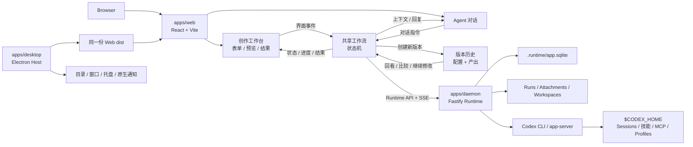

<div align="center">

<p>
  <picture>
    <source media="(prefers-color-scheme: dark)" srcset="../images/opencreator-lockup-dark.svg" />
    
  </picture>
  <br />
  <picture>
    <source media="(prefers-color-scheme: dark)" srcset="../images/opencreator-slogan-zh-dark.svg" />
    
  </picture>
</p>

OpenCreator 是一站式内容创作 Agent 工作台，把视频、图像、配音等创作工具，与项目、会话、技能、MCP 和长期任务放进同一个工作空间。

OpenCreator 由 [KrillinAI](https://github.com/krillinai/KrillinAI) 全面升级而来，从 AI 视频翻译工具演进为一站式内容创作 Agent 工作台。

<a href="https://trendshift.io/repositories/13360" target="_blank"></a>

[English](../../README.md) | **简体中文**

[](https://github.com/krillinai/KrillinAI/stargazers)
[](https://space.bilibili.com/242124650)
[](https://jq.qq.com/?_wv=1027&k=754069680)

[创作工具](#创作工具) · [主要功能](#主要功能) · [产品展示](#产品展示) · [案例展示](#案例展示) · [快速开始](#快速开始) · [Desktop](#desktop) · [系统架构](#系统架构) · [开发指南](#开发指南) · [文档](#文档) · [Star 趋势](#star-趋势)

</div>

> [!IMPORTANT]
> OpenCreator 当前处于快速迭代阶段，建议先从源码运行。执行真实 Agent 任务需要本机已安装并登录 [Codex CLI](https://github.com/openai/codex)；AI 图像、视频和语音能力还取决于对应服务配置。


## 项目介绍

OpenCreator 面向需要在本机持续完成创作与开发任务的个人和团队。它不重新实现一套 Agent loop，而是以 Codex CLI 作为执行内核，在其上提供稳定的本地 Runtime、可视化工作台和 Desktop 宿主。

产品包含两条可以相互衔接的主线：

- **AI 内容创作**：从工作台进入视频翻译、视频生成、数字人口播、智能配音、自动剪辑、图像生成等专用工作区。
- **通用 Agent 工作台**：按项目组织会话，让 Run 在后台持续执行，并统一处理审批、附件、文件、技能、MCP、计划任务、通知、记忆和诊断。

Web 是唯一的前端实现；Desktop 直接加载同一份 Web 构建产物，只额外提供目录选择、窗口生命周期、托盘和原生通知等系统能力。因此在相同数据和内容视口下，两端拥有一致的通用界面与 Runtime 行为。

## 创作工具

工作台当前提供以下专用入口。实际可用的模型与服务由本地 Codex 环境、AI 服务设置和可选企业网关共同决定。

| 工作区 | 具体能力 |
| --- | --- |
| 视频下载 | 解析 YouTube、Bilibili 等平台的公开视频链接，查看可用清晰度和格式，并下载视频或音频供后续创作使用 |
| 视频翻译 | 导入本地或公开视频；通过云端或本地 Whisper 服务转写；利用 LLM 上下文完成字幕断句、对齐、术语处理和翻译；设置双语字幕、配音或自定义声音样本、字幕样式及横竖屏合成，并导出 SRT、音频或成片 |
| 智能剪辑 | 分析长视频语义，设置内容偏好、目标时长、画幅和片段数量，从开头吸引力、完整度、情绪和传播潜力四个维度评分，再审核字幕并导出所选片段 |
| 火柴人视频生成 | 选择预设或自定义角色、发展故事、生成和编辑分镜、逐镜审核，再加入配音和音乐，并保留多版本动画结果 |
| AI 视频生成 | 使用 Seedance、可灵或 Veo，根据提示词、服务商、画幅、分辨率和时长生成视频，持续查看任务进度，并预览和下载结果 |
| 数字人口播 | 围绕人物、口播文案、声音表达、场景和画面构图，完成结构化的数字人视频创作流程 |
| 智能配音 | 修改文案，选择音色与表达风格，调整语速，试听生成音频，并导出 MP3、WAV 或其他已配置格式 |
| 图像生成 | 使用 GPT Image、即梦、可灵或 Gemini，设置提示词、画幅、质量和生成数量，预览并单独下载图片 |
| 封面生成 | 结合主题、视频链接和参考图片生成多版内容封面，并进行对比选择 |

## 主要功能

### 项目特色

- 🔗 **状态同步**：工作台操作与 Agent 指令共享状态机，步骤、进度和结果始终一致。
- 🕘 **版本管理**：每次修正创建新版本，保留历史配置与产出，方便回看和比较。
- 🤖 **Codex 原生执行**：直接复用 Codex 的 Agent loop、模型、推理、工具调用、会话、Skills 和 MCP，不维护第二套执行引擎。
- 🧩 **技能扩展**：浏览、安装并调用技能，通过 Codex 原生配置管理 MCP。
- 📅 **计划任务**：在专属会话中管理定时任务，完整保留每次 Run 的历史。
- 🧠 **记忆摘要**：管理全局、项目和线程记忆，为每次 Run 保存摘要与输入快照。
- 🔐 **本地安全**：数据、附件和日志默认留在本机，支持权限审批和诊断脱敏。

## 产品展示

### 创作工作台

从工作台进入视频翻译、动画、数字人、图像生成、配音、剪辑等专用创作工作区。


## 案例展示

### 视频翻译

下面的公开案例来自同一团队的开源视频本地化项目 [KrillinAI](https://github.com/krillinai/KrillinAI)，展示了成熟的字幕对齐、翻译、配音与竖屏交付流程。OpenCreator 的视频翻译工作区会把这套能力接入更完整的 Agent 创作流程。

KrillinAI 曾对一段 46 分钟的本地视频进行一键处理，全程没有人工调整字幕。其公开结果完整覆盖原视频，没有字幕遗漏或重叠，断句自然，译文质量稳定。


<table>
<tr>
<td width="33%">

#### 字幕翻译

https://github.com/user-attachments/assets/bba1ac0a-fe6b-4947-b58d-ba99306d0339

</td>
<td width="33%">

#### 智能配音

https://github.com/user-attachments/assets/0b32fad3-c3ad-4b6a-abf0-0865f0dd2385

</td>
<td width="33%">

#### 竖屏模式

https://github.com/user-attachments/assets/c2c7b528-0ef8-4ba9-b8ac-f9f92f6d4e71

</td>
</tr>
</table>

> 视频与字幕对齐图片来源：[KrillinAI](https://github.com/krillinai/KrillinAI)。

### 智能剪辑

把访谈、播客、课程等长视频转成能够独立传播的高光片段。自动剪辑工作区会分析字幕语义，并从开头吸引力、语义完整度、情绪强度和传播潜力四个维度为候选片段评分，再帮助创作者审核、选择和导出最值得发布的内容。


### 火柴人动画

OpenCreator 与艺术家合作设计了这套原创角色形象，为故事和动画提供风格统一、可直接投入创作的预设角色；创作者也可以上传参考图，或使用 Agent 生成自己的角色。


从角色与故事创意开始，Agent 工作台会继续引导分镜生成、镜头审核、配音、音乐和多版本动画输出。


## 快速开始

### 环境要求

- Node.js 22 或更高版本
- pnpm 9.15.0（仓库已在 `packageManager` 中锁定版本）
- 可在终端执行的 Codex CLI
- 真实模型任务需要 Codex CLI 处于有效登录状态

先确认本地环境：

```bash
node --version
pnpm --version
codex --version
```

### 从源码启动 Web

```bash
git clone https://github.com/krillinai/OpenCreator.git
cd OpenCreator
corepack enable
pnpm install
pnpm web:dev
```

打开 `http://127.0.0.1:9000/`。开发服务器会按需启动本地 daemon，并通过同源代理注入临时 Runtime token，不需要手工复制连接信息。

首次启动时，Runtime 会准备默认项目；连接完成后输入框即可直接使用。如果只需要调试 daemon：

```bash
pnpm daemon:dev
```

daemon 只监听本机回环地址，并在 stdout 输出一次连接地址和临时 token。

## Desktop

Desktop 与浏览器版使用 `apps/web` 的同一套 React 前端。通用项目、会话、任务和设置都调用相同的 Daemon/API；Electron 只补充真实系统路径、窗口、托盘和原生通知等能力。

### 开发模式

```bash
pnpm desktop:dev
```

### 本地打包

| 命令 | 产物 |
| --- | --- |
| `pnpm desktop:package` | 当前平台的可运行目录，适合本机验证 |
| `pnpm desktop:dist` | 当前平台的安装包 |
| `pnpm desktop:release` | 运行正式发布打包入口 |
| `pnpm --filter @opencreator/desktop verify:package` | 校验已生成的 Desktop 包 |

Desktop 打包会重新构建当前工作区的 Web，记录 commit、dirty 状态、平台、架构和 Web 哈希，并比较 `apps/web/dist` 与 App 内嵌资源；内容不一致时会直接失败。签名、公证、Windows 构建和正式发布要求见 [Desktop 发布手册](../operations/opencreator-desktop-release-runbook.md)。

## 核心工作流

### 会话与 Run

1. 选择项目或创建新对话。
2. 输入任务，并选择权限、Profile、模型和推理强度。
3. Run 执行期间可以排队发送后续任务，或立即打断当前任务后继续。
4. 在 Timeline 查看推理摘要、工具调用、文件变更、审批和最终结果。
5. 从任务中心统一追踪运行中、已完成、失败和待审批任务。

### 技能与 MCP

- 在插件中心浏览技能市场、安装记录和本机已有技能。
- 在输入框中通过 `/` 或添加菜单选择技能，让后续任务按对应工作流执行。
- MCP 管理优先透传 Codex 原生命令与配置，不维护第二套执行引擎。
- 默认使用当前 `$CODEX_HOME`，因此修改全局技能或 MCP 前应确认影响范围。

### 已安排与任务会话

- 每条计划任务拥有一个长期专属 OpenCreator 会话。
- 自动触发、立即运行和用户追问复用同一会话，并按 `queue` 或 `skip` 策略串行处理。
- 删除计划任务会归档专属会话，但保留既有 Run、结果和底层 Codex 历史。
- 底层 Codex thread 轮换或失效恢复不会改变 OpenCreator 的任务入口与页面路由。

## 系统架构

OpenCreator 将可视化工作台与 Agent 对话视为同一创作任务的两种交互界面，而不是两套彼此独立的流程。每个创作工作流都通过状态机建模：素材输入、参数设置、生成、审核、修改和导出被定义为明确的状态与事件。工作台操作和对话指令进入同一个状态机，当前步骤、配置、进度、版本与结果再同步呈现在两侧，从架构上避免出现两份相互冲突的任务状态。

创作天然需要反复调整，因此修改不会直接覆盖当前结果。每次修正或重新生成都会基于现有工作流状态创建新版本，同时保留历史版本的配置与产出，让创作者可以随时回看、比较，并从任一阶段继续完善。



核心原则：

- 工作台与 Agent 对话是同一份工作流状态的同步投影；两侧都向同一个状态机发送事件，不各自维护一套任务状态。
- 每次修正都会创建新版本而不是替换现有结果，完整保留每一轮创作的上下文与产出。
- 前端不直接启动 Codex，也不依赖 Codex 原始 JSONL 事件格式。
- daemon 负责进程生命周期、事件标准化、持久化、审批、计划任务和通知 outbox。
- Codex 仍然是 Agent loop、技能和 MCP 的执行真相源。
- Browser Bridge 与 Desktop Bridge 不分别实现通用业务逻辑。

## 项目结构

```text
OpenCreator/
├── apps/
│   ├── web/          # 唯一的 React 前端实现
│   ├── daemon/       # 本地 Fastify Runtime 与 Codex 适配层
│   ├── desktop/      # Electron Main、Preload、原生能力与打包
│   └── harness/      # Runtime 命令行验证工具
├── packages/
│   ├── protocol/     # Web、Daemon、Desktop 共用的 Runtime 契约
│   └── skill-market/ # 技能市场模型与共享逻辑
├── docs/             # 设计、API、运行手册和验收文档
├── scripts/          # 仓库级检查脚本
└── .runtime/         # 本地运行数据（首次启动后生成）
```

## 配置

### AI 服务 API Key

打开 **设置 → AI Services**，配置文本、语音识别、配音、图像和视频生成所使用的服务。每个分类只显示当前服务商需要的字段，包括 Base URL、API Key、模型、代理或服务商专属凭据。


凭据通过本地 Runtime 的系统凭据存储进行保存，不应提交到仓库。Edge TTS 等本地或系统服务不需要填写 API Key。

### Runtime 环境变量

大部分用户不需要设置环境变量。需要隔离数据、指定 Codex 或调整托管目录时，可以使用：

| 环境变量 | 默认值 | 用途 |
| --- | --- | --- |
| `OPENCREATOR_DATA_DIR` | `.runtime` | OpenCreator 数据库、Run、附件和托管工作区目录 |
| `OPENCREATOR_CODEX_BIN` | `codex` | Codex CLI 可执行文件路径 |
| `CODEX_HOME` | `~/.codex` | Codex 会话、配置、技能、MCP 和 Profile 的真相源 |
| `OPENCREATOR_DEFAULT_CWD` | 当前工作目录 | daemon 的默认执行目录 |
| `OPENCREATOR_DEFAULT_PROJECT_ROOT` | Runtime 默认策略 | 托管项目根目录；设置后使用其下的 `OpenCreator/` |
| `OPENCREATOR_CODEX_THREAD_ROTATION_RUN_THRESHOLD` | `50` | 长期计划任务底层 Codex thread 的终态 Run 轮换阈值，设为 `0` 可关闭主动轮换 |

例如，将 Runtime 数据与 Codex 环境都隔离到指定目录：

```bash
OPENCREATOR_DATA_DIR=/path/to/opencreator-data \
CODEX_HOME=/path/to/codex-home \
pnpm web:dev
```

企业网关不接受任意环境变量注入，必须通过受控配置文件启动。配置方式见 [企业网关配置说明](../企业网关配置说明-2026-08-06.md)。

## 数据与安全

默认 Runtime 数据位于仓库根目录的 `.runtime/`：

| 路径 | 内容 |
| --- | --- |
| `.runtime/app.sqlite` | 项目、线程、Run、事件、计划任务、通知、附件元数据、审批、记忆和摘要 |
| `.runtime/runs/` | 每次 Run 的脱敏日志、诊断与元数据 |
| `.runtime/attachments/` | 受控保存的附件文件 |
| `.runtime/workspaces/` | Runtime 托管的项目工作区 |

Codex 自身的会话与配置仍位于 `$CODEX_HOME`，备份时需要与 `.runtime/` 分开处理。

安全边界包括：

- daemon 仅监听 `127.0.0.1`，除健康检查外的 API 都要求 Bearer token。
- HTML 预览默认禁用脚本、导航和弹窗，只允许受控的同工作区相对资源。
- 敏感记忆必须二次确认，OpenCreator 不会自动永久保存未确认内容。
- Diagnostics 和 Run 日志在返回或导出前进行脱敏。
- Desktop 包启用 ASAR 完整性、Cookie 加密，并关闭 RunAsNode、`NODE_OPTIONS` 和 Node CLI Inspector。

完整备份、恢复、清理和重置步骤见 [用户指南与故障排查](../opencreator-user-guide-and-troubleshooting.md)。

## 开发指南

### 常用命令

| 命令 | 说明 |
| --- | --- |
| `pnpm web:dev` | 启动 Web，并按需启动本地 daemon |
| `pnpm daemon:dev` | 只启动 daemon |
| `pnpm desktop:dev` | 构建依赖并启动 Electron 开发模式 |
| `pnpm test` | 运行工作区单元与集成测试 |
| `pnpm typecheck` | 运行全仓 TypeScript 类型检查 |
| `pnpm build` | 构建全部 workspace |
| `pnpm e2e` | 运行 Web Playwright E2E |
| `pnpm smoke:ci` | 运行 fake Codex Runtime smoke |
| `pnpm perf:check` | 检查已记录的性能基线 |

提交前至少运行：

```bash
pnpm test
pnpm typecheck
pnpm build
```

涉及 Desktop、Host Bridge、Runtime 代理或通用前端流程时，还必须完成 Web/Desktop 一致性测试、实际打包 App E2E，以及 Web 构建产物哈希校验；只通过 Web 单测不能证明 Desktop 可发布。

真实 Codex smoke 默认不会运行，显式启用方式：

```bash
OPENCREATOR_RUN_REAL_CODEX_SMOKE=1 \
pnpm --filter @opencreator/daemon test -- test/smoke/real-codex-smoke.test.ts
```

## 常见问题

<details>
<summary><strong>页面一直显示正在连接本地运行内核</strong></summary>

确认 `pnpm web:dev` 没有退出，并访问 `http://127.0.0.1:9000/.opencreator/runtime/healthz`。正常响应应为 `{"ok":true}`。如果 9000 端口被占用，先停止旧进程再重试。

</details>

<details>
<summary><strong>可以打开页面，但无法执行真实任务</strong></summary>

先运行 `codex --version` 检查 CLI 是否可见，再确认 Codex 登录状态。出现 `401 token_expired` 或 `refresh_token_reused` 时需要重新登录 Codex，不要通过删除 `.runtime` 规避认证问题。

</details>

<details>
<summary><strong>为什么浏览器版没有“选择本机文件夹”或窗口控制</strong></summary>

这些入口依赖 Electron 提供真实系统路径或窗口能力，只在 Desktop capability 可用时显示。项目、会话、任务、文件编辑等通用功能仍由 Web 和 Desktop 共用。

</details>

<details>
<summary><strong>如何备份所有本地数据</strong></summary>

停止 Web 与 daemon 后备份整个 `.runtime/`，不要只复制 SQLite；附件和 Run 快照存放在独立子目录。Codex 的 `$CODEX_HOME` 需要另行备份。

</details>

更多问题见 [用户指南与故障排查](../opencreator-user-guide-and-troubleshooting.md)。

## 文档

- [用户指南与故障排查](../opencreator-user-guide-and-troubleshooting.md)
- [Runtime API v1](../runtime-api-for-ui-v1.md)
- [Codex-native Runtime 技术方案](../2026-07-03-codex-native-agent-runtime-design.md)
- [Desktop 发布手册](../operations/opencreator-desktop-release-runbook.md)
- [Windows Desktop 发布说明](../operations/opencreator-desktop-windows-release.md)
- [企业网关配置说明](../企业网关配置说明-2026-08-06.md)
- [视觉组件规范](../visual-component-guidelines.md)

## 翻译约定

根目录 `README.md` 是内容基准英文版，持续维护的翻译统一放在 `docs/<locale>/README.md`。只有完成全文翻译并与英文结构同步后，才把对应语言加入顶部切换栏。

## 参与贡献

1. 在 [Issues](https://github.com/krillinai/OpenCreator/issues) 中描述问题、使用场景和预期行为。
2. 从最新分支创建范围清晰的功能或修复分支。
3. 遵循仓库现有架构，通用产品能力只在 Web + Daemon 实现一次，原生差异通过 capability 隔离。
4. 为行为变化补充相应的单元、集成或 E2E 测试，并在 Pull Request 中写明已运行和未运行的验证。
5. 不提交 `.runtime/`、本机凭据、Codex 会话、构建缓存或其他用户数据。

## Star 趋势

OpenCreator 是 KrillinAI 的下一阶段演进。在仓库升级完成前，下图沿用原 [`krillinai/KrillinAI`](https://github.com/krillinai/KrillinAI) 仓库的 Star 历史。

[](https://star-history.dera.page/#KrillinAI/KrillinAI&Date)

## 致谢

OpenCreator 构建于 [OpenAI Codex](https://github.com/openai/codex)、[React](https://react.dev/)、[Fastify](https://fastify.dev/)、[Electron](https://www.electronjs.org/)、[SQLite](https://www.sqlite.org/) 和 [Model Context Protocol](https://modelcontextprotocol.io/) 等项目之上。

---

<div align="center">

**OpenCreator · Create locally, work continuously.**

</div>
